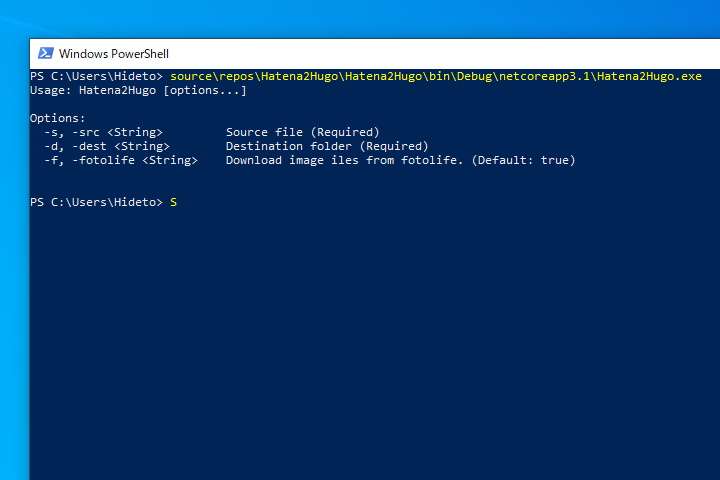
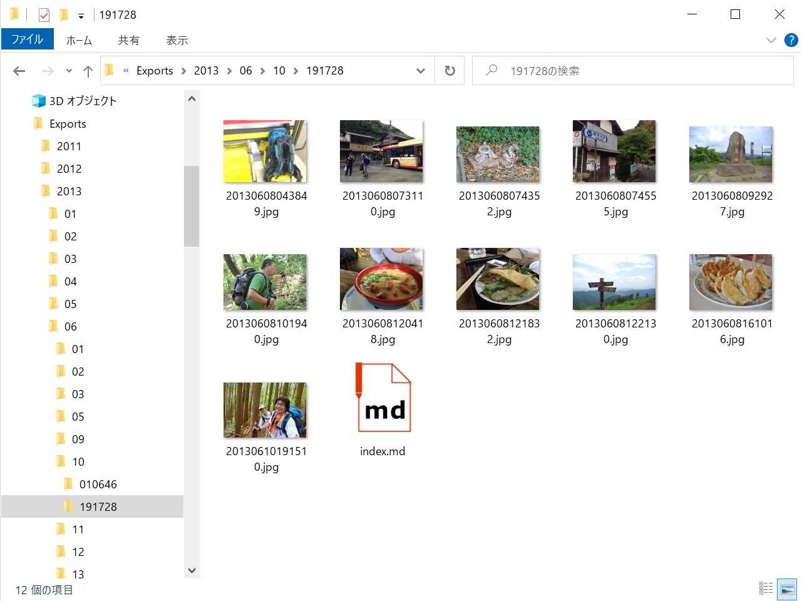

はてなブログから Hugo へ移行するにあたり、よその開発者さんが Go で開発されているツールを使ったのですが、ちょっといろいろ問題があり……それを直すのに正規表現で置換したのですが、そこでもちょっとやらかした関係で、いろいろ不具合が発生していました。

<blockquote class="twitter-tweet"><p lang="ja" dir="ltr"><a href="https://twitter.com/daruyanagi?ref_src=twsrc%5Etfw">@daruyanagi</a> だるログ、移行した時に「画像の次の文字が削れてる」みたいな挙動になってる？</p>&mdash; (＃＾ω＾)らむさら＠二次会禁止 (@ramusara) <a href="https://twitter.com/ramusara/status/1256774385517473793?ref_src=twsrc%5Etfw">May 3, 2020</a></blockquote> <script async src="https://platform.twitter.com/widgets.js" charset="utf-8"></script> 

<blockquote class="twitter-tweet"><p lang="ja" dir="ltr">だるろぐ、 #### の展開に失敗してる？</p>&mdash; さくさん (@ch3cooh) <a href="https://twitter.com/ch3cooh/status/1256800289744580608?ref_src=twsrc%5Etfw">May 3, 2020</a></blockquote> <script async src="https://platform.twitter.com/widgets.js" charset="utf-8"></script>

しょうがないので、ツールを自分で作り直してデータを再生成してみました。



ツールは GitHub で公開しています。名前は適当なので、カブっていたらごめんなさい。

[daruyanagi/Hatena2Hugo](https://github.com/daruyanagi/Hatena2Hugo)

## Hatena2Hugo とは

はてなブログ からエクスポートしたデータ（Movable Type 形式）を Hugo へインポートできる形式へ変換します。.NET Core 製のコンソールアプリです。

単一ファイルの Movable Type データを記事単位に分割し、記事データを適切なフォルダーへ吐き出します。HTML → Markdown や Shortcode への変換は行わず、素直なつくりを目指しました。ただし、はてなフォトライフの画像をローカルにダウンロードしてリンクを書き換える機能だけは、自分が欲しかったためつけています。

## 使い方

```
Usage: Hatena2Hugo [options...]

Options:
  -s, -src <String>         Source file (Required)
  -d, -dest <String>        Destination folder (Required)
  -f, -fotolife <String>    Download image iles from fotolife. (Default: true)
```

各記事にはそれぞれフォルダーが作成され、その下にテキストが index.md として保存されます。-f オプションが有効であれば、はてなフォトライフの画像もこのフォルダーにダウンロードされ、記事内の画像リンクの `src` がローカルリンクに書き換えられます。



-f オプションを無効化するときは `false` と正しく入力してください。でないと、既定値の `true` と扱われます。

## ダウンロード

[Releases · daruyanagi/Hatena2Hugo](https://github.com/daruyanagi/Hatena2Hugo/releases)

## 検証環境

Windows 10＋.NET Core 3.1 で開発し、Windows 10 で動作を確認しました。ほかの環境での動作は保証できませんが、たぶん動くんじゃないでしょうか。

はてなブログでエクスポートしたデータの記事部分は html 形式になっていますが、インポート先の Hugo でインデントが Markdown の引用として解釈されてしまう問題を回避するため、インデントは一律削除されています。そのため、`pre > code` 内のソースコードインデントも失われていますが、これはこのツールの制限です（修正予定はありません）。

## 謝辞

以下のライブラリを提供してくださった開発者に感謝します。

- [Cysharp/ConsoleAppFramework: Micro\-framework for console applications to building CLI tools/Daemon/Batch for \.NET Core, C\#\.](https://github.com/Cysharp/ConsoleAppFramework)

## 追記

<blockquote class="twitter-tweet"><p lang="ja" dir="ltr">-fotolife &lt;String&gt;なのにDefault: trueなのか…<br><br>.Net Coreでコンソールアプリを素直に作るとそうなる感じなのかな</p>&mdash; じょーさん@人生何度でもやり直し (@elf) <a href="https://twitter.com/elf/status/1257031083922604033?ref_src=twsrc%5Etfw">May 3, 2020</a></blockquote> <script async src="https://platform.twitter.com/widgets.js" charset="utf-8"></script> 

たぶん僕がちゃんと [ConsoleAppFramework](https://github.com/Cysharp/ConsoleAppFramework)  を理解せずに使っているせいだと思います。そのうちちゃんと使いこなせるようになりたいですね！


