

このエントリは @shibayan の提供でお送りしております。

## 4月30日のある日

ゴールデンウイーク前の追い込みにもなんとか対処がつきそうな目星がついた4月30日のおやつ時。気晴らしに Twitter をしていると、何となく話の流れでウニを送ってもらえることになった。

<blockquote class="twitter-tweet">
<a href="https://twitter.com/daruyanagi?ref_src=twsrc%5Etfw">@daruyanagi</a> <a href="https://t.co/uHcbNZMk3P">https://t.co/uHcbNZMk3P</a>
&mdash; しばやん (@shibayan) <a href="https://twitter.com/shibayan/status/1255746487264276480?ref_src=twsrc%5Etfw">April 30, 2020</a></blockquote>  

<blockquote class="twitter-tweet" data-conversation="none">
ありがとう……ありがとう……待ってる
&mdash; #だるやなぎ40 (@daruyanagi) <a href="https://twitter.com/daruyanagi/status/1255746669242544128?ref_src=twsrc%5Etfw">April 30, 2020</a></blockquote>  

<blockquote class="twitter-tweet" data-conversation="none">
見て楽しんで
&mdash; しばやん (@shibayan) <a href="https://twitter.com/shibayan/status/1255746795533037569?ref_src=twsrc%5Etfw">April 30, 2020</a></blockquote>  

<blockquote class="twitter-tweet" data-conversation="none">
鬼畜か
&mdash; #だるやなぎ40 (@daruyanagi) <a href="https://twitter.com/daruyanagi/status/1255746866735509505?ref_src=twsrc%5Etfw">April 30, 2020</a></blockquote>  

<blockquote class="twitter-tweet" data-conversation="none">
2 万文字でレビューするなら送ってやらんこともない
&mdash; しばやん (@shibayan) <a href="https://twitter.com/shibayan/status/1255747377371082752?ref_src=twsrc%5Etfw">April 30, 2020</a></blockquote>  

<blockquote class="twitter-tweet" data-conversation="none">
頑張る
&mdash; #だるやなぎ40 (@daruyanagi) <a href="https://twitter.com/daruyanagi/status/1255747554555293697?ref_src=twsrc%5Etfw">April 30, 2020</a></blockquote>  

箱1つ、6,700円に送料までかかるとのことで、当初は「ほんまに送る気かいな」と半信半疑だったが……

## 5月3日――邂逅。

<blockquote class="twitter-tweet">
うに！ <a href="https://t.co/BFRgIuNMFl">pic.twitter.com/BFRgIuNMFl</a>
&mdash; #だるやなぎ40 (@daruyanagi) <a href="https://twitter.com/daruyanagi/status/1256852989907570688?ref_src=twsrc%5Etfw">May 3, 2020</a></blockquote>  

それから数日して、本当に到着した。郵便局のお兄さんから小柄な、でもガッシリとした発泡スチロールのボックスを受け取る。「ウニ注意」という見たこともない注意書きのラベルが箱の上面に貼り付けられており、弥が上にもテンションが高まる。それにしても「なまもの」「この面を上に」のラベルはわかるとして、「こわれもの」ってなんぞや。ウニはこわれるのか？　こわれたウニはどうなるのか？

大変気にはなったが、とりあえず冷凍庫に入れて仕事を片付けよう。そう思い、箸と御手塩、醤油差し、チューブのワサビだけを用意して書斎に戻った。今日中に終わる目途がついたとはいえ、まだ仕事がたんまり残っているのだ。楽しみはお預けにして、とりあえずやるべきことを片付けてしまわねば。

それにしても、こんな高そうなものをポンと送ってくれるとは。カネを稼いでいる人はカネの使い方が違うな、と心底思う。もっと稼いで、じゃんじゃんウニを送ってくれれば、失われた30年なんぞ一挙に覆せるのではないか。日本経済に貢献するため、彼は毎月僕に四海の珍味を送るべきではないか。

――などなどと考えながら取り組んでいたせいか、結局、その日は仕事を終わらせるのに8時ぐらいまでかけてしまった。いつもは遅くても6時に切りあがるので少し油断していたが、思ったよりも手ごわかったのだ。

やっとこ仕事から解放され、喜び勇んでウニの入った発泡スチロールの箱を冷凍庫から取り出し、台所に転がっていた包丁を入れて丁寧にビニールテープを切り裂き、中身を取り出すと、ウニさんは完全に凍っていた。――失敗失敗。不承不承、解凍のためにウニは冷蔵庫に戻し、一日置くハメになった。せっかくウニさまをお迎えしておいて、なんたる失態。頓首頓首、死罪死罪。

### 5月4日――いざ、試食。

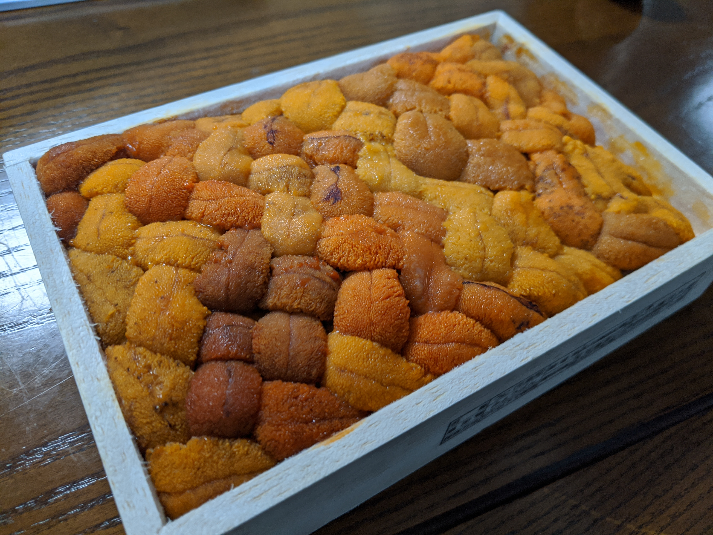

翌日、ウニはいい感じに解凍されていた。木箱を覆うプラスチックの蓋をとると、微妙に色の違うウニたちが折り重なるように、箱一杯にキレイに詰められている。さしずめ、食の宝石箱といったところか。まるで美しい織物のようでもある。思わず口の端が垂れて、フフッと笑い声が漏れてしまう。これは控えめに言って、最高だな！

学生時代は居酒屋でバイトをしていたので、こういう木箱入りのウニは見慣れたものだ。しかし、自分の家でこれを目にするのは生まれて初めて。なんせ、僕程度の所得ではウニを木箱ごと買うことなんかない。回転寿司でちょっと気が大きくなり、えいやっとウニの軍艦巻きをとってみたはいいけれど、色が悪く、苦いだけのウニに幻滅。__「たまには合成ウニじゃなく、ホンモノのウニを食べてみたいものだぜ」__ などと嘯いてみたりする……自分にとってウニとは半ばそういう存在だったが、そのホンモノが目の前にある！　なんと幸せなことだろうか？　他力のおかげとはいえ、ウニを木箱ごと食べられる身分になろうとは想像もできなかったことだ。「持つべきは友人」とはよく言ったもので、大変ありがたい。

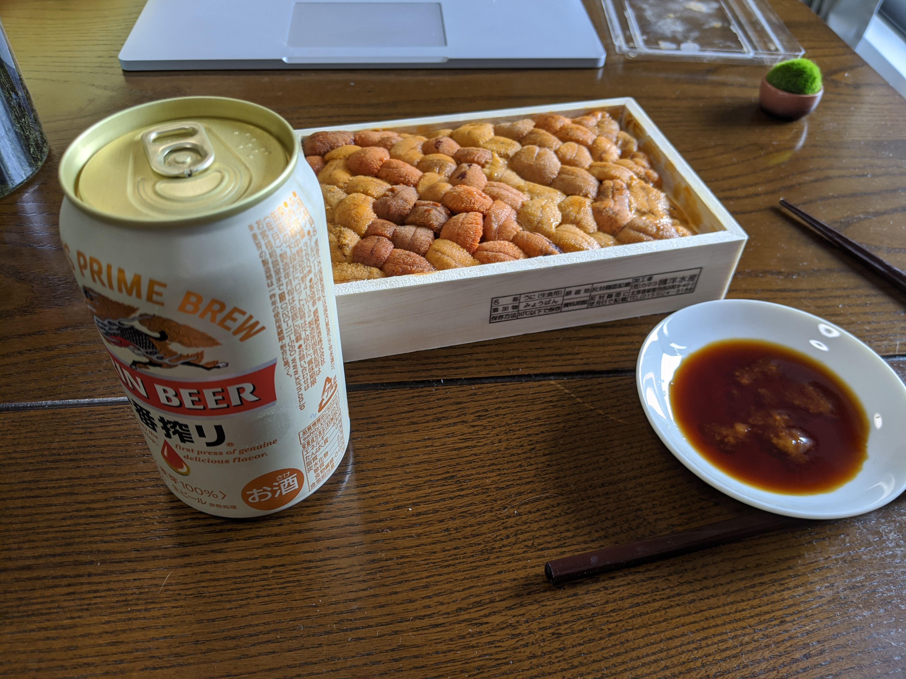

さっそく冷蔵庫から秘蔵のビールを取り出し、震える手を抑えながら、箸でそっとウニを口に運ぶ。__「デリシャス……」__ 脳みそからシワというシワがなくなり、すべての IQ を喪失してしまったかのような感想しか出てこない。

しかし、それが本当に正直なお気持ち。人間、感極まると「あぁ……」だの「おぉ……」だのといった声しか出なくなるが、まさしくそんな感じだ。

しかし、レビューを2万字も書かなければいけない関係上、__「デリシャス……」__ では済まされぬ。目を閉じて無理にでも舌の上に物語を感じなければなるまい

――オホーツクの海岸に転がり、むしゃむしゃとコンブを食べるウニたちの微笑ましいさま。そのなかで一人の、もとい、一匹の雄ウニが都コンブを差し出すと、雌のウニは少し顔を赤らめ、それをおずおずと受け取る。二匹？を見守るものは、冷たい荒波と北の海に沈みゆく夕日のみ。トゲトゲの影が長く伸び、いつしかそれが暗闇に溶ける頃、二匹にも蕩けるような時間が訪れるのだった。アーーーッ！

しかし、二匹にハッピーエンドは訪れない。ウニたちを待ち受けるのは日露の領土問題。あるウニは日本人に、あるウニは露西亜人に狩られ、ロミオとジュリエットさながら引き裂かれる。

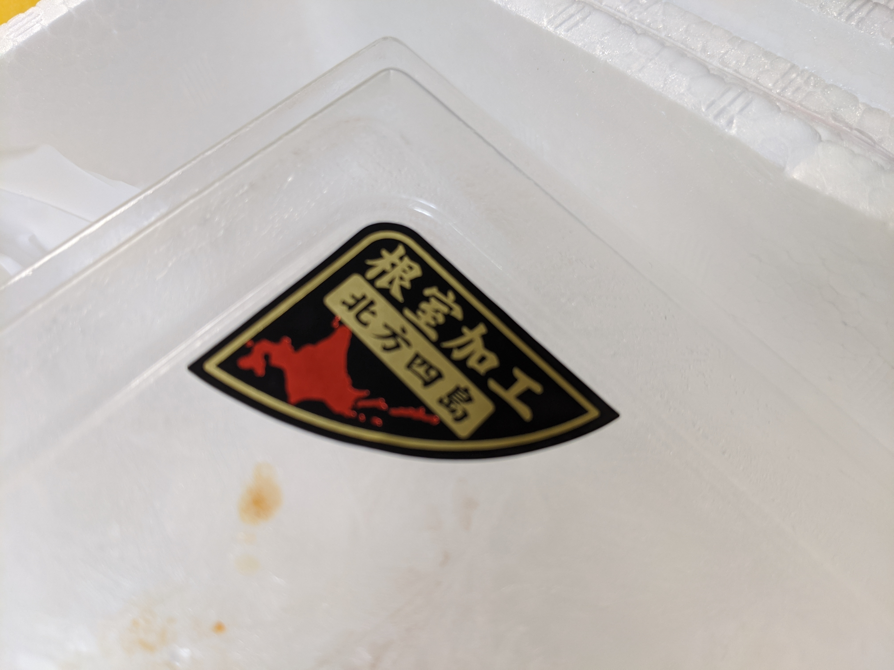

捕らわれたウニたちに、もはや人権、もといウニ権はない。一匹一匹裸に剥かれ、バイヤーの舐めるような視線の下、一粒一粒選別され、挙句は奴隷船のごとく木箱に詰められ、南へ送り出される。そして、行きつく先は日本に住む無職独身40歳男性の口。男はウニを下で弄び、その脳みその皴を伸ばしていく。__「デリシャス……」__ 

だるやなぎには味がわからぬ。だるやなぎは、40歳の無職独身男性である。Twitter でホラを吹き、ネコと遊んで暮してきた。けれども領土問題に対しては、人一倍に敏感であった。

「これほど見事なウニを産する島が3日の距離にある」……僕は独り言ちた。古代ローマの偉大な政治家、マルクス・ポルキウス・カトーが今の日本で衆議院議員をやっていたならば、予算委員会の席でモリカケ、サクラ、コロナの話に逐一こう付け加えただろう。__「ともあれ、私はロシアは滅ぼされるべきであると思う」__ ウニのふるさと、北方領土はなんとしてでも取り返さなければならない。ウラジオストクを灰にし、塩を撒け。オホーツク海は我が海。スキピオ・エミリアヌスの涙で、ありったけのウニを塩漬けにするのだ。

## ところで、バフンウニについて

ところで、今回送られてきたウニの種類は何なのだろう。一口にウニといっても全世界で約870種が確認されているといい、なかなかに個性のあるヤツらなのだ。僕がウニ警察であれば一目で看破したろうが、悲しいかな、節穴なのでさっぱりわからない。ただただ、おいちぃ……。

もっとも、日本ではバフンウニ、ムラサキウニ、アカウニあたりが主流。今回もらったウニも、おそらくバフンウニあたりだろう。

それにしても、この**バフンウニ**というクッソまずそうな名前。誰が付けたのだろう……きっと中途半端に小賢しいヤツで、 _ウンコ_ くさい名前にしておけばみんなが寄り付かず、ウニを独占できるとでも思ったのであろう。まったく、まるで だるやなぎ のようではないか？　

しかし、その命名の甲斐あってか、この _ウンコ_ のような物体の旨さは世界に秘されているらしい（ただし、異常な旨いものセンサーを備えるフランス人を除く）。世界で消費されるウニのほとんどは、日本人の腹の中に入る。しかも、その9割は輸入だ。外国のウニ漁師はきっと __「ジャパニーズはこんな _ウンコ_ みたいなのを食うのか？　ファッキュー、クレイジー！」__ とでも思っているに違いない。

全知全能の Wikipedia によると、バフンウニ（馬糞海胆、馬糞海栗、学名: Hemicentrotus pulcherrimus）はオオバフンウニ科に属するウニの一種で、バフンウニ属 Hemicentrotus に属す唯一の種であるという。古来より食材として知られており、おそらく縄文時代よりこの _ウンコ_ は食されていた。8世紀に書かれた「出雲風土記」には「ウニ」や「カセ（ガゼ）」と呼ばれ登場する。

>   では、うにがはじめて書物に出てくるのはいつ頃なんでしょう？
>   
>   まず７５７年に施行された『養老律令』のなかに「ガゼ」という名前で登場しているとされています。そのほかの古文書にも「海胆」、「海栗」、「霊螺」、「宇爾」、「宇仁」等の文字が散見できるそうです。このころは主に生のまま食べられていたと思われます。
>   
>   生のうにの事を海胆と呼ぶのに対して、うにに塩を加えた呼び名である「雲丹」という言葉が出てくるのは江戸時代に入ってからのようです。
>
>   [うに加工品の歴史 \| 山口県うに協同組合](https://uni.or.jp/products/history)

>   かせ【甲蠃／石陰子】  
>   《「がぜ」とも》ウニの別名。また、その殻。
>   「御肴 (みさかな) に何よけむ鮑 (あはび) 栄螺 (さだを) か―よけむ」〈催馬楽・我家〉
>
>   [石陰子（かせ）の意味 \- goo国語辞書](https://dictionary.goo.ne.jp/word/%E7%9F%B3%E9%99%B0%E5%AD%90/)

「石陰子」の例文に挙げられている

>   我家は　帷帳も垂れたるを  
>   大君来ませ　婿にせむ  
>   御肴に何よけむ  
>   鮑栄螺か　石陰子よけむ  
>   鮑栄螺か　石陰子よけむ  

という歌（催馬楽）は平安時代に流行った古代歌謡で、鮑（アワビ）や栄螺（サザエ）のようなご馳走（御肴）はないけれど、石陰子（ウニ）でよければウチのお婿さんになってくれという意味らしい。アワビ・サザエには一等劣るけれど、それなりのご馳走ではあったようだ。ちなみに、この催馬楽「我家」は『源氏物語』にも引かれている。

>   「中将を厭ひたまふこそ、大臣は本意なけれ。交じりものなく、きらきらしかめるなかに、_大君_ だつ筋にて、 かたくななりとにや」
>   とのたまへば、  
>   「_来まさば_、といふ人もはべりけるを」  
>   と聞こえたまふ。  
>   「いで、その _御肴_ もてはやされむさまは願はしからず。ただ、幼きどちの結びおきけむ 心も解けず、年月、隔てたまふ心むけのつらきなり。まだ下臈なり、世の聞き耳軽しと思はれば、知らず顔にて、ここに任せたまへらむに、うしろめたくは ありなましや」

ハイコンテクスト過ぎてよくわからんが、現在のヲタクもすぐガンダムのセリフを改変して会話に潜り込ませたりするから、人のことは言えない。

話のついでのもう一つ脱線すると、詩といえば、僕がかつて通っていた小学校の校歌に芭蕉が読んだウニの俳句が取り入れられている。

>   香に匂へ　ウニほる丘の　梅の花

もっとも、このウニは「石炭」のことらしく、無機的で臭く、風流とは程遠いウニと、色鮮やかで香しい梅の対比がポイントとなっている。石炭とウニには何か共通点があったのだろうか、残念ながら自分は知らない。単に音が通じているだけなのかもしれない。

――閑話休題。

海の方のウニといえば、近いのは石炭よりも梅の花の方だろう。トゲトゲに守られたグロテスクな状態ならともかく、木箱に整然と盛られた様子は花のように美しい。儚いところも通底していて、腐りもすれば、そのまえにグズグズに崩れてしまう。

なので、古代の人は海辺に住むのでもなければウニの入手に相当苦労したはずだが、奈良時代にはウニを用いた保存食まで存在したという。古くは越前の「泥うに」、それを発展させ、長崎のからすみ・尾張のこのわたとともに日本の三大珍味として知られるようになった「塩うに」、少し時代は下って下関のアルコール漬けなどはとくによく知られている。もっとも、僕はどちらも食べたことはないが……。

>   さかのぼること奈良時代  
>   福井には生ウニの保存方法として  
>   「泥うに」といわれるウニの加工品があり、  
>   朝廷に献上していたという木簡が残されています。
>
>   [天たつの汐うにを知る　01 \- 汐うにとは \| 天たつ 福井片町本店 二百年雲丹商 \| 公式オンラインショップ](https://www.tentatu.com/shiouni/)

>   江戸時代から越前では漁師が年貢として塩うにを納めていたといわれています。
>   その当時から塩うに100ｇで米１俵の価値があったそうです。
>
>   [043 江戸時代から続く特別な贈り物「汐うに」 \| 福井県特産品、名産品のアンテナショップ \| ふくい291](https://fukui.291ma.jp/special/707)

>   下関でウニを食用とした歴史は古く、安岡の潮待貝塚からは、約二千年前のウニの殻がタイの骨と一緒に発見されている
>
>   [うにの歴史 \| 株式会社うに甚本舗　アルコール漬け「粒うに」専門店　創業大正三年](http://www.unijin.com/knowledge-02)

おぉ……この赤間関（下関）の粒ウニ、結構美味しそうだな……山口県は今住んでいる愛媛県の対岸（フェリーで松山から柳井までいける）なのに、いまだに行ったことはあれ、泊ったことはない。フグもおいしいというし、今度食いに行くってみるか。

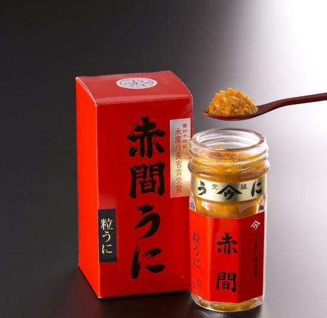

また、ウニは古代ローマでも食されていた。

>   ネロ皇帝に仕えたペトロニウスによる風刺小説『サテュリコン』には、翼を付けて天馬(ペガサス)に見立てたウサギ焼きや、胡椒ソースの中で泳ぐように飾られた煮魚、ソーセージを腸に見立てて詰め込んだ豚の丸焼きといった仕掛け料理が登場します。
>   また、プルーンにトゲを刺してウニを表現したり、豚肉をまるで鳥料理や魚料理のように仕立てるといった模造料理も紹介されています
>
>   [客を驚かせたい！古代ローマで考案されたぜいたくな料理 \- パンタポルタ](https://www.phantaporta.com/2017/11/blog-post8.html)

ここに紹介したのは「プルーンにトゲを刺し」た謂わばディスプレイだが、実物も当然食べられていたらしい（[人糞が明かす古代ローマ人の生活 \| ナショナルジオグラフィック日本版サイト](https://natgeo.nikkeibp.co.jp/nng/article/news/14/4482/)）。おそらく生のものを塩やガルム（魚醤）で味付けして食べたのではなかろうか。もしかすると、かの美食家・ルクルスの食卓にも並んでいたのかもしれない。

それにしても、だ。塩漬けだの、アルコール漬けだの、現代人もびっくりのグルメぶりではないか？　なにせ古代にはクロネコヤマトのクール宅急便も家庭用冷凍庫もない。保存の工夫はあったとはいえ、内陸の都に運ぶのは相当に手間がかかることで、そうしてようやく届けられたウニも品質は今よりも数段落ちたはずだ。そもそも日本の場合は北海道産ですらなく、おそらく近場で採れた、いわゆるフツーのウニであったろう（古代ローマも北方ではなく地中海産に違いない）。それでも、人々はウニを求めた。その情熱は現代にも引き継がれ、一皿300円のウニ軍艦が回転寿司屋で珍重されていると思うと、なんとなく人間、食欲だけは今と変わらないのだな、歴史を貫いているのだな、などと感じる。

現在、日本で食されるウニの大半は輸入だ。2018年の統計では、ウニの輸入先は以下の通りとなっている（[冷凍ウニ１８年輸入１割減　チリ産歩留まり低下響く/生鮮は海外消費進み２割減 / みなと新聞 電子版](https://www.minato-yamaguchi.co.jp/minato/e-minato/articles/88609)）。それによると、ウニは大きく分けて活ウニ、生鮮ウニ、冷凍ウニの3つの形態で輸入されるようだ（そのほかにも、塩で漬けたものや加工済みのものもある）。

### 活ウニ

たぶん殻付きの新鮮なヤツ。この状態で輸入されるウニがもっとも多く、その多くはロシアからとなっている。新鮮なのはいいが、殻をあけるまでは当然中身はわからないわけで、目利きが問われるのだろう。今回のウニ業者もそこをひどくアピールしている……が、ミョウバンに漬けて木箱に入っちゃえば、どれも一緒かなって気がしないでもない。

||2017年|2018年|
|--|--|--|
|ロシア|8,016|8,129|
|米国|119|122|
|カナダ|210|242|
|その他|8|0|
|合計|8,353|8,492|

### 生鮮ウニ

殻をとって、ミョウバンの入った水で洗ったヤツ。ミョウバンでウニを洗うと、ウニは溶けにくくなるのだそうだ。

||2017年|2018年|
|--|--|--|
|米国|129|93|
|カナダ|218|175|
|中国|131|70|
|その他|655|521|

カナダを筆頭に、生鮮ウニは米中からの輸入が多い。アメリカ・カナダからの輸入は船便ではなく、航空便なのであろう。そういえば、成田空港は隠れた「巨大漁港」。有名なのは冷凍マグロだが、ウニも成田空港の税関を通るに違いない。

>   東京税関によると、生鮮・冷蔵の生マグロの輸入量で成田空港は圧倒的な国内シェアを誇る。２０１７年の輸入量は１万１８００トンで全体の７７％を占め、２位以下の関西空港（１３％）、羽田空港（３％）を大きく引き離す。全国の港で水揚げされるマグロや冷凍マグロの輸入量に比べると量は少ないものの、多くの日本人に好まれる「生マグロ」の一大輸入拠点に変わりない。
>   
>   [成田空港改め「成田漁港」？　巨大空港の意外な一面：朝日新聞デジタル](https://www.asahi.com/articles/ASL8L2CF1L8LUTIL008.html)

### 冷凍ウニ

名前の通り、冷凍した状態で輸入されるウニ。地球の裏側から運んでくるウニはだいたい冷凍されている。殻まで運ぶのは採算が良くないので、身だけとって詰めてから送られるのだろう（知らんけど。

||2017年|2018年|
|--|--|--|
|チリ|1,890|1,637|
|カナダ|34|41|
|その他|2,008|1,772|

ウニの生産が一番多いのはチリで、二番目はロシア。三番目が日本となり、あとは中国やカナダといった具合。ウニが好む海藻類は、ある程度海水温の低いところでないと育たないため、基本的には寒い国が有利なようだ。

なかでもチリのウニ漁獲量は抜群で、世界のウニ漁獲量の半分以上を占めているそうな。チリはもともと自国でもウニを消費していたが、その頃の漁獲高はせいぜい3,000トンほどしかなかった。しかし、日本でウニが高く売れることが知れ渡ると、1990年代半ばまでは潜水漁業に規制がなかったこともあり、漁獲高は急増。1999年にはピークに達し、殻付きで55,000トンを産するまでになった。

もっとも、こんな調子で乱獲していれば、海産資源は早晩底をつく。そこでチリ政府は漁獲制限を導入するとともに、復興省の外郭団体である漁業振興研究所（IFOP）を中心に養殖にも力を入れているのだという。とはいえ、違法ダイバー問題はいまだ根強く残っているようではあるが（多少古い資料に基づいているので、現在がどうかはよくわからない）……どっちにしろ、いわゆる「貴重な解散資源」というヤツになっているわけだ。

## 日本のウニ漁獲高ランキング ～そして、知られざる「ウニの害」

一方、日本のウニ漁獲高は世界第4位（2018年）。北海道から九州にかけ広く生息するためどこでも採れるが、前述の理由で漁獲高の大半は北国が占める（北海道、東北だけで8割）。海水温上昇の影響を受けにくいのもあるに違いない。先ほど紹介したアルコール漬けで有名な下関（山口県）は、漁獲高全国7位。「泥ウニ」の福井は統計にでるほどの漁獲高がない。採れないことはないだろうが、品質の良いものがまとまって採れないのだろう。加工品もよそで採れたもので作っているのではないだろうか。

|都道府県|漁獲量|割合|
|--|--|--|
|北海道 |4,386t |55.2%|
|岩手県 |1,094t |13.8%|
|青森県 |593t   |7.5%|
|宮城県 |460t   |5.8%|
|長崎県 |417t   |5.2%|
|鹿児島県 |212t   |2.7%|
|山口県 |161t   |2.0%|

なお、ウニの食べごろは、卵巣が成熟して産卵する初夏から夏にかけて（旬は土地によって結構異なる）。ウニは浅い海から深い海の底まで広く分布しているが、深海は食物に乏しいため、食されるのはもっぱら浅海で採れたものだ。潜って採れないことには、採算も合わないしね。

養殖は試されてはいるものの、コストの問題であまり一般的ではないようだ（前述のチリは苗を作るだけで、どっちかっていうと「栽培漁業」になるのかもしれない）。とくに課題となっているのはエサの確保。ウニは何でも食べるようだが、神戸牛がビールを飲むように、おいしいウニを育てるには質のよい海藻をたくさん与えなければならない。しかし、この海藻の確保が難しいのだという。

>   ウニはワカメや昆布などの海藻を大量に食べる。キタムラサキウニの場合、水温によっては約1万匹を育てるのに約3トンの昆布が必要だ。海藻が少ない冬場は身が育たないため、養殖するには大量の海藻を冷凍しておくなどの手間がかかる。だが、冷凍すると解凍後の傷みが早いため、餌の確保が難しいという。
>
> [「幸せの軍艦巻き」も？　クローバーのエサでウニ養殖　九大・宮城大チームが特許出願 \- 毎日新聞](https://mainichi.jp/articles/20190613/k00/00m/040/028000c)

クローバーやキャベツ、ダイコンといったエサが試されてはいるものの、回転寿司のウニ軍艦が100円皿にのって回るようになるにはまだ時間がかかるようだ。

一方で、その食欲の旺盛さから一部で問題も引き起こしている。

>   海藻を食い荒らし、駆除の対象となっているムラサキウニに、本来は廃棄されるはずのキャベツや大根を食べさせたところ、甘みのある良質のウニに生まれ変わった――。神奈川県水産技術センター（三浦市）がそんな実験に成功した。
>
>   センターによると、ムラサキウニが増えて岩場の海藻を食い尽くすなどの被害が各地で問題となっている。ただ、ムラサキウニの殻を割っても食用となる「生殖巣」はほとんど入っていない。
>
>   [迷惑ウニ、廃棄野菜で美味に変身？　商品化へ実証実験：朝日新聞デジタル](https://www.asahi.com/articles/ASK4T51RCK4TULOB01N.html)

ウニが大量発生するならウハウハじゃないか？　などと思いがちだが、そううまくはいかないのが世界の面白いところだ。肝心の中身が入っていないなら、人間にうれしい要素は一つもない。ただのトゲトゲだ。

中身がスカスカのトゲトゲは海藻を食い荒らし、海を「砂漠」にしてしまう。この状態は「磯焼け」「磯枯れ」と呼ばれており、全国各地で深刻な問題となっている。

>   海の中には昆布やわかめ、ひじきのような海藻類の大群落「藻場」があるんですけれど、その「藻場」が様々な原因によって消失して、それが持続することを「磯焼け」と読んでいます。
>   鹿児島だけではなくて、全国各地で発生している深刻な海の環境問題です。
>   
>   深刻な環境問題「阿久根のウニ」の生息する海を守る取り組みウニのほかにも磯で暮らす様々な貝類も海藻を食べます。
>
>   生態系のバランスが良い時は問題ありませんが、これらの生物、特にウニ類が増えすぎてしまったことで、磯焼けが大きな問題となってしまいました。
対策も行われています。
>
>   [深刻な環境問題「阿久根のウニ」の生息する海を守る取り組み \| 海と日本PROJECT in 鹿児島](https://kagoshima.uminohi.jp/report/uni/)

>   東日本大震災の津波で環境が変わった三陸の海で、ウニの異常な大量発生が起きている。身の入りが悪く売り物にならない上、海藻を食べ尽くして「磯焼け」が生じ、隠れ家や産卵場所を失った魚まで数を減らす結果に。豊かな海を復活させようと、地元の漁師らが取り組みを続ける。
>   
>   ウニの大量発生によって、海底の海藻が食べ尽くされた（2月、宮城県南三陸町沿岸）=共同
>   
>   「ウニは海藻の茎をかじって倒し、根こそぎ食べるんです」。
>
>   [三陸の海でウニ大量発生、海藻の食害深刻　身も少なく　（写真=共同）　:日本経済新聞](https://www.nikkei.com/article/DGXLASDG22H93_Y7A320C1CR0000/)

全知全能の Wikipedia さんによると、「磯焼け」「磯枯れ」はなにもウニだけのせいではなく、原因はさまざまのようだ。

- ウニや小型巻貝、アイゴ、チヌなどの藻食生物による食害
- 無節サンゴモの優占
- 恒常的な海の波浪や海底の侵食
- 漂砂による傷・汚れ
- 日射量の減少による光合成阻害
- 泥等による海藻胞子の基質付着の阻害
- 海域の栄養塩濃度の低下（貧栄養化）に伴う、海藻の成長不良（栄養不足）
- 海藻の成長を阻害する有毒物の影響
- 浅場の埋め立てや防波堤の設置による浅場の消失や湾内等の停滞水域の増加
- 船舶の船底塗料、下水処理場等の残留塩素、環境ホルモン、農薬、除草剤等の人工的な有毒物
- ダムや堰の造成による海域での浮泥の増加（胞子の基質付着の阻害）
- 陸域負荷量の慢性的な増加等によって海域の栄養塩濃度が増加（富栄養化）したり、浅場の埋め立てや防波堤等の設置により海水が停滞し、植物プランクトンが恒常的に繁殖しやすくなり、透明度が低下する。これに伴う、日射量の減少による光合成阻害
- 陸域負荷量の削減等による海域の栄養塩濃度の低下（貧栄養化）に伴う、海藻の成長不良（栄養不足）
- 地球温暖化による海水温の上昇や海流・気候の変化（台風の増加等）

「生態系のバランス」なんていっても所詮、人間にとっての話で、ウニはウニで自分たちが生きるので必死なのだろう。土地の人には迷惑なだけだというのは重々承知の上だが、それでもウニが怒られるのはちょっとかわいそうだなと思わないでもない。そもそも、よくよく見ると半分ほどは人間のせいで、ウニさんごめんなさいといった感じだ。

ちなみに、英語でウニは sea urchin などという。たまにゲームでウニっぽいモンスターが「アーチン」という名前で登場したりするが、urchin 単体はラテン語の「ハリネズミ（echinos）」に由来する（わんぱく小僧、いたずらっ子、浮浪児という意味もあるようだ）。

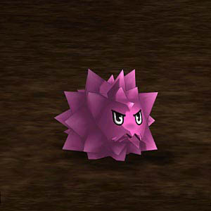

個人的にはウニ＝美味しい食べ物というイメージしかなかったが、なかなかにわんぱく小僧の一面もあるようで、お付き合いはそれなりに難しいらしい。

## 天よ、俺のケツをみさらせ！ ～ウニは奇妙な生き物

また、ウニはその生態も興味深い。食べようという意欲をそぐ要素（日本人を除く）は、なにも _ウンコ_ のような見た目や、 _ウンコ_ そのままの名前だけではない。ウニというのは見れば見るほど珍妙な生き物でもあるのだ。

自分などはウニを貝の一種かと勘違いしていたが、どちらかというとウニはヒトデやナマコに近い。専門的には棘皮動物門 （Echinodermata）にカテゴライズされるが、これは文字通り「ハリネズミ（echinos）」のようなトゲをもつ「皮（derma）」を纏うことを特徴とする。ウニがヒトデやナマコに近いのではなく、むしろヒトデやナマコの方がトゲのないウニのようなものだ、とでも表現すべきだろうか。

>   棘皮動物門に属する動物の総称。体は5放射相称形で，内部に石灰質の骨板あるいは骨片をもつ。また水管系をもち，これによって運動，呼吸，排泄などを行なっている。すべて海産で，ウニのある種を除いて底生生活をするが，幼生はすべて左右相称形で，自由遊泳をする。起源は古く，カンブリア紀に出現し，オルドビス紀にはすでに主要なものがほとんど現れていた。現生のものは約 6000種が知られており，ウミユリ綱，ヒトデ綱，クモヒトデ綱，ウニ綱，ナマコ綱に分けられる
>   
>   [棘皮動物\(きょくひどうぶつ\)とは \- コトバンク](https://kotobank.jp/word/%E6%A3%98%E7%9A%AE%E5%8B%95%E7%89%A9-53294)

生物としては人間なんかよりもだいぶ先輩で、古くから存在する。かつては今よりもっと多種多様な種が存在したようだが、その大半は絶滅し、現在はナマコ・ウミユリ・クモヒトデ・ウニ・ヒトデの5つのグループ（綱）しか残っていない。淡水や陸上に進出したものはなく、すべて海に棲んでいるのも特徴といえるかもしれない。

なぜ陸上で転がるウニ、闊歩するヒトデが存在しなのか――その理由はわからないが、一つに構造が極めて原始的であることが挙げられる。なんせこいつらには基本的に脳や臓器をもたない。

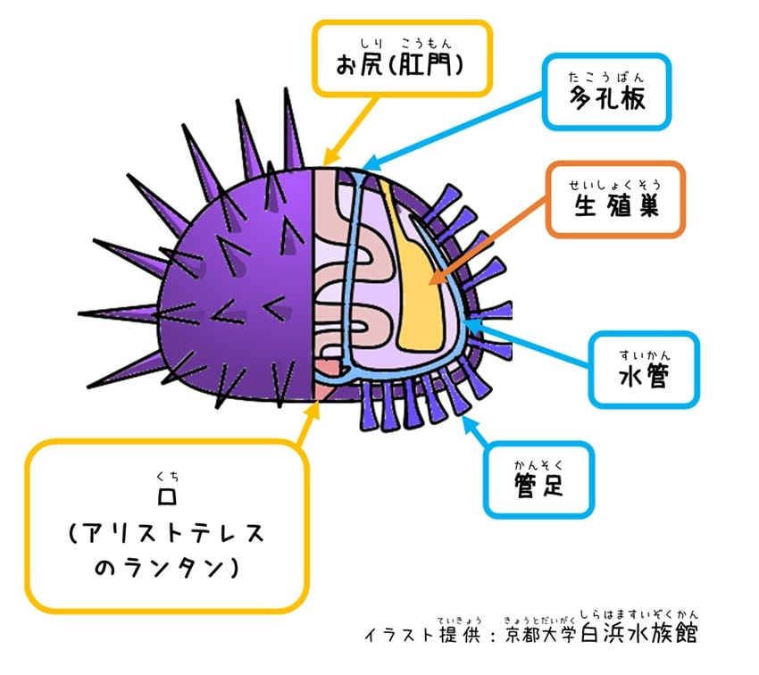

ウニは一般的な動物とは天地がさかさまで、背中（上）に肛門、腹（下）に口を持ち、それを消化管が繋いでいる。そのほかには管足と呼ばれる足のようなもの、呼吸や循環などを担う水管、海水を取り入れる多孔板、生殖をおこなう生殖巣などを持つ。ウニは息をしない。体を海水がぐるぐるとめぐっており、そこから酸素を得ている。こんな作りでもそれなりに寿命はあり、バフンウニで7～8年、キタムラサキウニで14～15年生きるという。つまり、僕が今からキタムラサキウニを飼えば、55歳ぐらいまでは一緒に暮らすことができるわけだ。さらに近年の調査研究結果によると、なかには寿命が 200 歳にまで達するものもあるとか。しかも、生殖能力は 100 歳を超えても、10 歳のウニと変わらないらしい。老いてなお絶倫……我々も見習うべきところかもしれない。

さて、僕らが食すのは、このうちの生殖巣、つまり、精巣や卵巣にあたる。それ以外は人類にとって不要だ。

ウニには雌雄同体ものもあるが、一般的には雌雄が分かれており、雄は黄褐色の精巣を、雌は赤褐色の卵巣を持つ。今回いただいたウニは色とりどりだが、雌雄混在なのだろう。世の中にはウニの卵巣のみを集めたお高い木箱も存在するが、そういうのを目にするのはちょっとグレードの高い料理屋の厨房ぐらいだ。

ちなみに、ウニの口には「アリストテレスのランタン」というユニークな呼び名がある。古代ギリシャの哲学者アリストテレスは万物に通じた人物で、なんでも事細かに書き記したが、その書物の一つにウニに関する記述があり、口（咀嚼器）がランタンに似ていると紹介していたのだそうな。

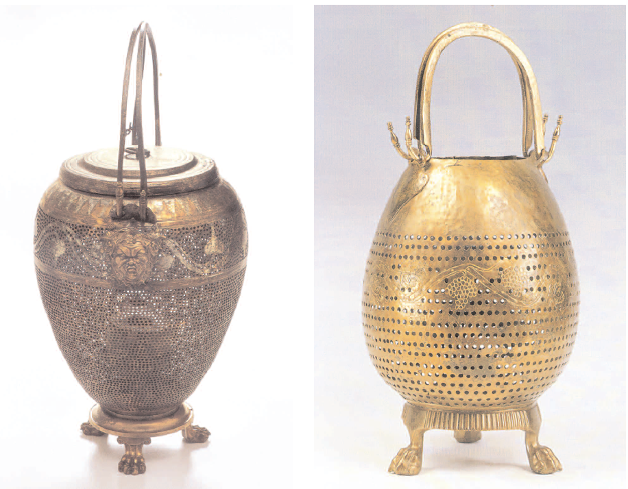

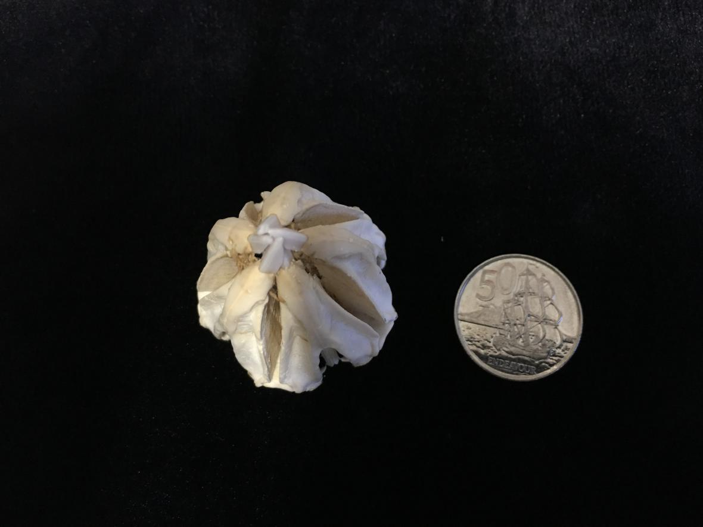

実際に見てみると、似ているようで、似ていないような（[Critter of the Week – Aristotle's lantern: Celebrating the Aristotle Anniversary Year \(2016\) \| NIWA](https://niwa.co.nz/blogs/critteroftheweek/208)）。アリストテレスが「ランタン」と表現したのは口ではなく、ウニの構造そのものであったともいわれている。どちらにしろ、ユーモラスな例えではないだろうか。

しかし、もしあなたが海に棲む生き物ならば、この「ランタン」にはちょっと注意したほうがいい。こいつはなかなかに凶悪で、硬いものも難なく噛み砕いてしまう。マケドニアのファランクス顔負けのトゲといい、ウニはかなりの戦闘民族といえる。

## ねんがんの *** を手に入れたぞ！

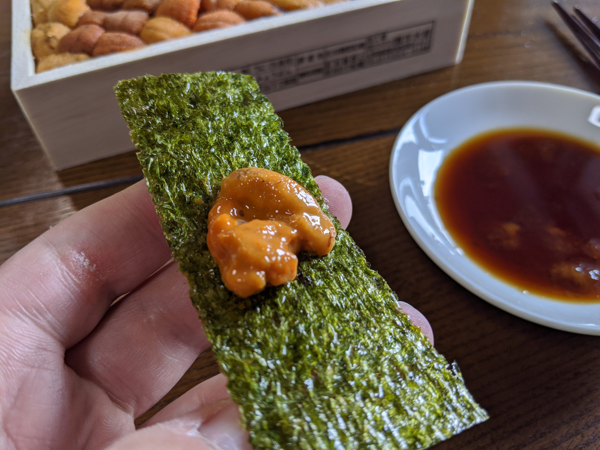

さて、試食の話に戻ろう。

箱に詰まったウニのうち、最初のうちは刺身醤油をつけて食べたり、味付け海苔に巻いて食したりした。味付け海苔の味がわからなくなるぐらい、濃厚な海の味がする。きっと、オホーツク海あたりで育った立派なコンブをむしゃむしゃ食べて育ったのだろう。わざわざ美味しく食べられるために育つとは、愛いヤツよ。海苔でまくなら味付け海苔ではなく、普通の海苔にすべきだろう。それでないと、ウニがもったいない。

話は飛ぶが、ウチの弟1号はイクラとウニが食べられない。別にアレルギーというわけでもなく、単に気持ち悪いらしいのだが、母はこの性質を大変褒めていた。家計が助かる、と。一方、長兄たる自分と末の妹はイクラとウニが大好きで、回転寿司にいくとこれでもかと食べていたので、母はいつもしかめっ面だった。ちなみに、弟2号はどうだったのかあまり覚えていない。というのも、卵ばかり食べていたからだ。

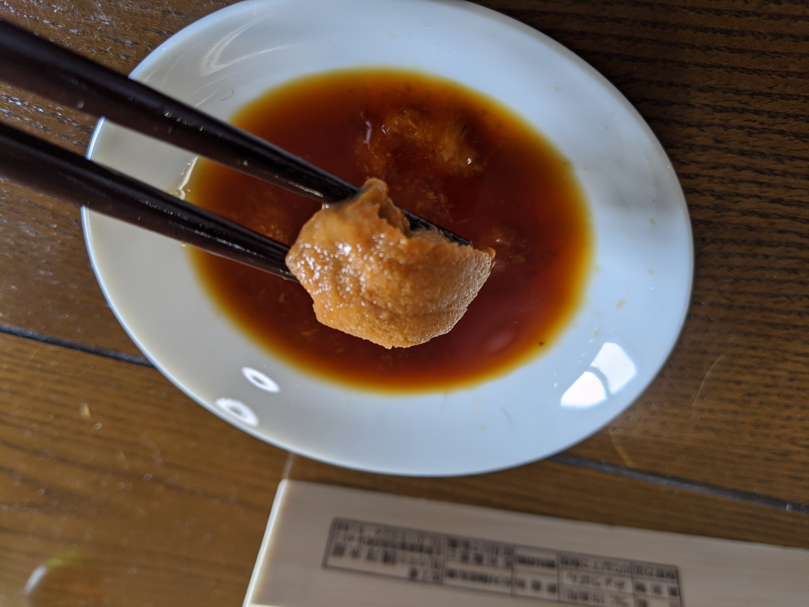

そんなことをふと思い出しながら、ちびりちびりとウニを舐めてはビールをのどに流し込んでいたが、瞬く間に一列すべてのウニが失われた。

しかし、このまますべて食べてしまうわけにはいかない。というのも、僕には長年温めていた野望があるからだ。

少し話は脱線するが、今から20年前のこと。僕は大阪から京都の大学に毎日通っていたが、さすがに地下鉄2回と京阪電車を乗り継ぎ、往復1時間半かかるのがだんだん苦痛になり、不動産需要の落ち着いた6月ごろに、親の許しを得て下宿することになった。高校の最後の1年間は寮で暮らしていたのが、初めての一人暮らしなわけだ。掃除と洗濯は一応できたが、自炊は初めて。記念すべき最初の食事は何にするか、いろいろ悩んだ。自分はいったい何が食べたいのか。できるだけリーズナブルに、しかも失敗なく作れるものは何か。

考えるうちにだんだん、脳みそが混乱してきたのであろう。結局、その日の夕ご飯は「生八つ橋」になった。

というのも、うちは4人兄弟。「生八つ橋」なんかを食べるときは4人で分けなければならず、一人にあたるのはせいぜい2個か3個だった。いつか箱ごと食べたい。弟妹と取り合いをせず、ゆっくり食べたい。できれば、皮と餡を分解して、皮だけを堪能してみたりしたい――そう思うようになっても不思議ではないだろう。悩みに悩んだうえ、ふとそのことを思い至り、長年の欲望を叶えんと思い立ったわけだ。

結果は無残なものだった。箱半分ぐらいは平らげただろうか、しかしそれ以上は。あんなにも好きだった生八つ橋が口に入ってものどを通らぬ。経済学基礎論で学んだばかりの限界効用逓減の法則を我が身で思い知ることになった。

それ以降、こうした愚行は避けているのだが、それでも一度やってみたいものがあった。**ウニの三重丼**である。

ウニの三重丼――それをどこで耳にしたのか、もはや覚えていない。よくある旅番組かグルメ番組か。大きな丼のなかにごはん、ウニ、ごはん、ウニ、ごはん、ウニと贅沢に重ねたその料理を食べるのは、長らく僕の夢だった。

<blockquote class="twitter-tweet">
伝説のウニ三重丼を食べに北海道行きたいんじゃー
&mdash; #だるやなぎ40 (@daruyanagi) <a href="https://twitter.com/daruyanagi/status/754730776223031297?ref_src=twsrc%5Etfw">July 17, 2016</a></blockquote> 

<blockquote class="twitter-tweet">
ウニの三重丼を食べてから死にたい
&mdash; #だるやなぎ40 (@daruyanagi) <a href="https://twitter.com/daruyanagi/status/1145947944064974848?ref_src=twsrc%5Etfw">July 2, 2019</a></blockquote> 

<blockquote class="twitter-tweet">
ウニの三重丼（ごはん、ウニ！ごはん、ウニ！ごはん、ウニ！……ﾉﾘ）食べるのが夢
&mdash; #だるやなぎ40 (@daruyanagi) <a href="https://twitter.com/daruyanagi/status/1238973979878014978?ref_src=twsrc%5Etfw">March 14, 2020</a></blockquote> 

僕は箱に残ったウニを目でざっくり数えた。一段目、二段目、三段目……いける、十分な量のウニは残っている。天の計らいか、ちょうどそのとき炊飯ジャーからビープ音があがった。――炊けてるぜ、兄弟。意を決して僕は立ち上がり、台所へ向かった。食洗器にぶち込まれたままの丼をとりだし、しゃもじを水で雪ぎ、控えめに盛る。

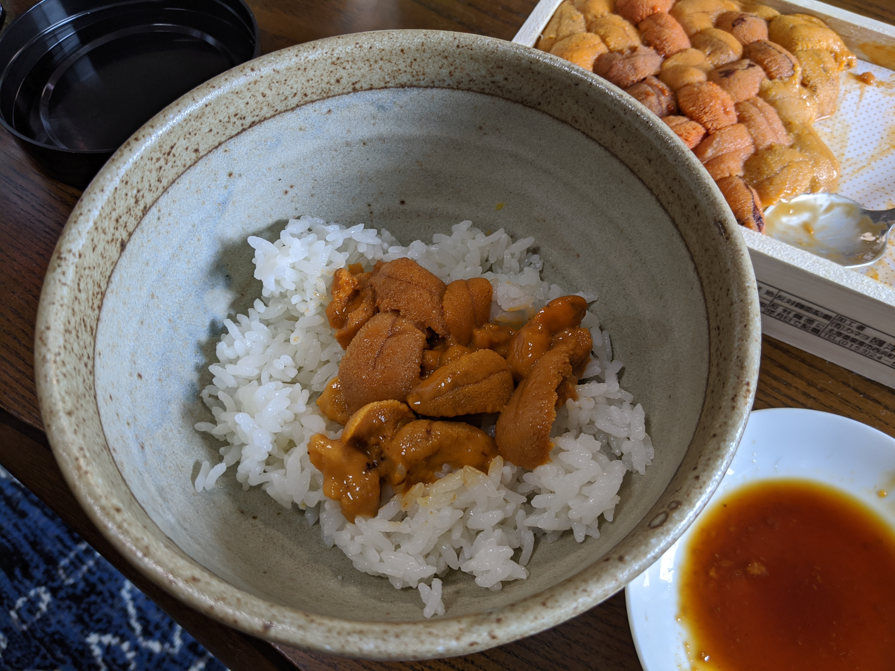

一段目の飯。スプーンでウニを掬ってのせる。通常の我が財政では、このぐらいの「ミニうに丼」が関の山だったろう。しかし、今の僕には木箱いっぱい（一列だけ食べちゃったけど）のウニがある。これだけ載せても、まだ大量のウニが残っているのだ！

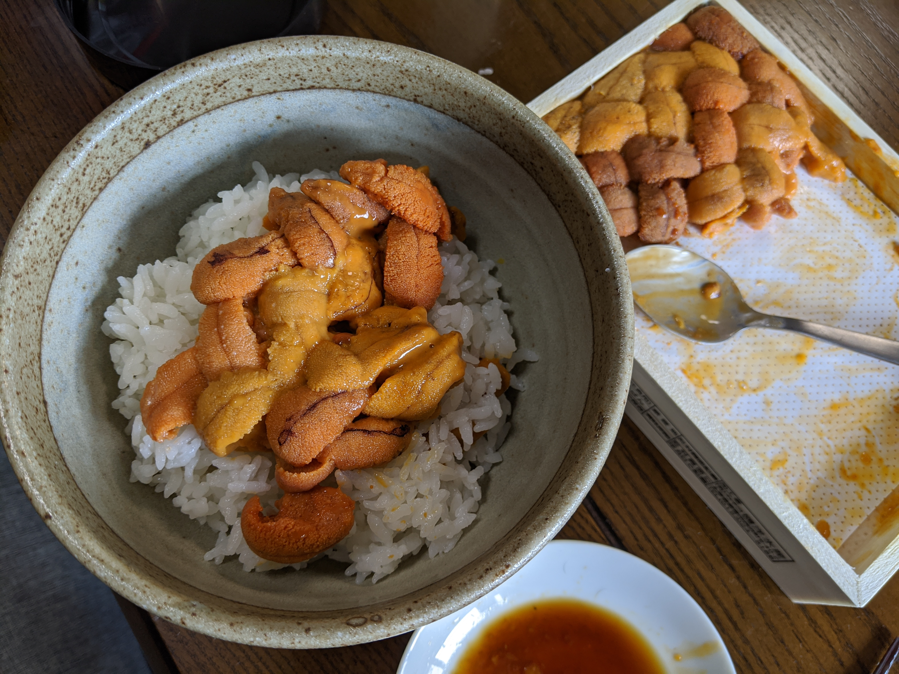

二段目の飯。箱に残ったウニの半分を豪快に投入する。アツアツのご飯に蒸されたのだろうか、なんとなくだけど磯の香りが強くなった気がする。早くがっつきてえなぁ、という思いを抑えながら……

三段目の飯。その頂に、ウニを残らず盛り付ける。ついでに、冷蔵庫にあったイクラのしょうゆ漬けと大葉も載せてみた。所詮、無色独身40歳男性の盛り付け、おしゃれとはいいがたいが、サービスエリアで出される海鮮丼のレベルには達したと思う。

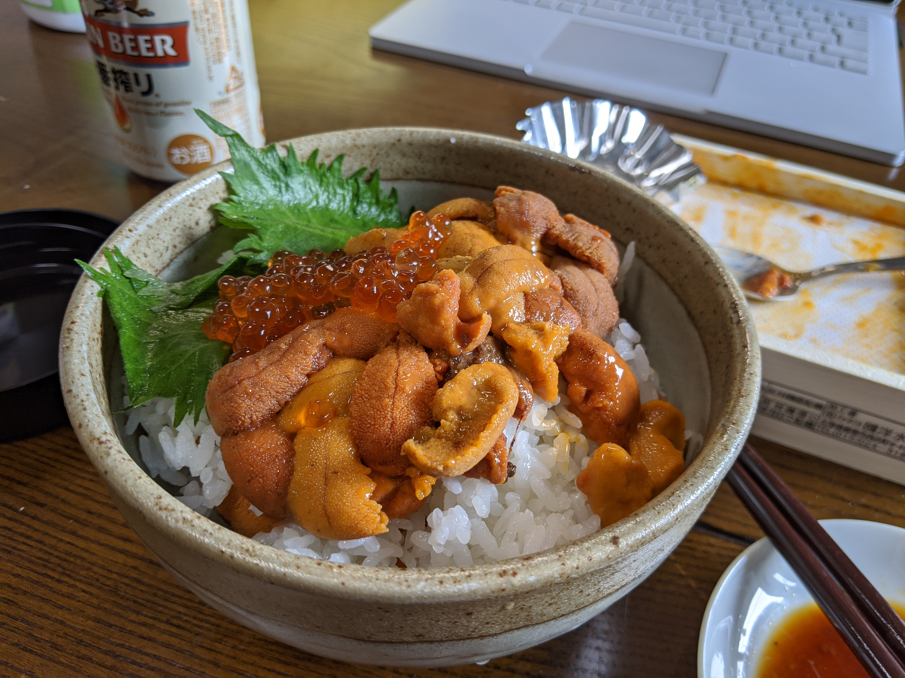

そして、最後にわさび醤油をひと回しして、伝説のウニの三重丼、完成。なんせ、一杯でも至福のウニ丼が、三重にも重なっているのだ。これぞ北海の自然が生み出した、自然の帝冠。この堂々としたたたずまい、ローマ教皇の三重冠にも勝るとも劣るまい。スイス歩兵のごとく付き従うイクラのいじらしさよ。彼らだけでも主役を張れるのに、今回ばかりはただの飾り物だ。

痛風と糖尿病がカツカツを音を立てて背後から迫りくるのを感じながら、丼を豪快に掻き込む――が、食べても食べてもメシとウニがある。

というか、思ったよりウニの量が多くて、コメにウニを絡めているというより、ウニにコメを添えて食べているイメージだ。40代に足を突っ込んだ自分には頭が重くなるほどの旨味で、少し辛い。僕は慌ててメシを足し、醤油を3度も回した。

それでもだいぶウニがコメに勝っているようだ。ウニは旨い。でも、調和を保つにはもっとコメが必要だ。もっと白いメシの援軍が必要だ……戦力の逐次投入という愚を犯しているという自覚はあったが、もはや止めることは能わぬ。ウニとコメがハーモニーを奏でる黄金比にたどり着くまで、僕はひたすらメシを足し続け、醤油をかけ続けた。

結局、丼を平らげたとき、2合炊いたご飯のほとんどが消え失せていた。ウニの旨味に対抗するには、これほどの犠牲が必要となるとは……僕はパンパンになったおなかを抱えながら、しばし呆然とした。

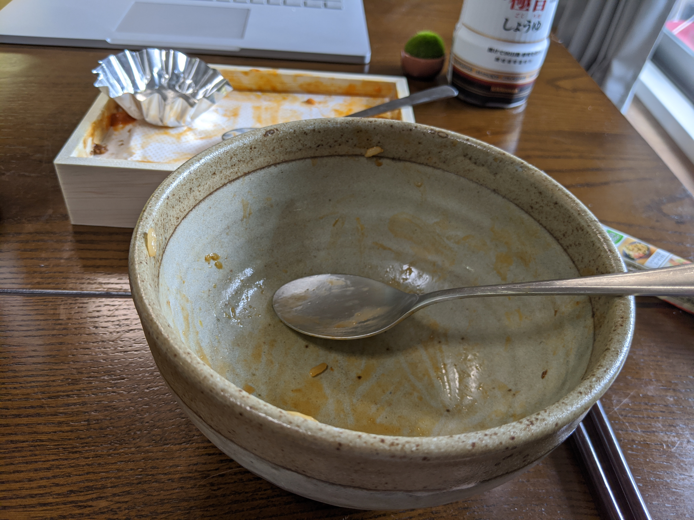

しかし、生八つ橋の愚行は今度こそ避けられたのだ。これはこれで偉大な勝利ではないか？　ウニの旨さに助けられたとはいえ、40代無職独身男性が2合ものメシを平らげたのだ。これは並大抵なことではない。竹帛に記すに足る偉業といえるだろう。

とはいえ、40歳独身男性には厳しいカロリー量であったには違いない。すべて食べ切ったあと、残ったのは達成感ではなく、「当分ウニは要らないな」という思いだった。ウニの三重丼は素晴らしい体験だった。しかし、やはりウニは珍味の類であり、美味しいのをちょっと食べるのがよいのではないだろうか。寿司屋で軍艦巻きをいくつか摘まむのが自分にはよい。

今回は三重丼への羨望のあまり、すべてのウニを丼につっこんでしまったが、本来、ウニの食べ方は多種多様。塩ウニ、焼きウニ……ウニソースにしてパスタやムニエルに和えてもいいいいかもしれない。自分は知らなかったのだが、広島には「ウニホーレン」という食べ方があり、結構おいしいのだそうな。

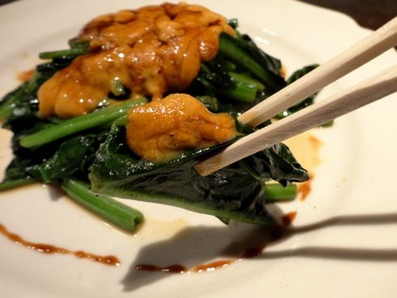

単にホウレンソウのバター炒めにウニをのっけただけ……のようにも見えるのだけど……これは今度食いに行かなくてはなるまいな。お酒の飲める鉄板焼き屋さんなら食べられるそうなので、~~広島焼~~ 広島風お好み焼きを食べるついでに頼むとよさそう。なに、愛媛・松山からであれば、フェリーで一本。1時間か2時間で行ける。

ちなみに、ウニの隠れた本場・チリでは玉ねぎ、パクチーのみじん切りにレモンをかけて食べるのだそうな。

![激安ウニ大国チリ！たったの800円でウニを満腹まで食べられる国はチリだった | Guanxi Times [グアンシータイムス] - https://wakuwork.jp/archives/9043](image31.jpg)

これもなかなかおいしそう。地球の裏側まで行くのは大変だけど、toto を一発当てたら行ってみてもいいかなと思う。

## 追伸

安請け合いしたけど、2万字で感想を書くというのは割と苦行だった。ぶっちゃけた話、ウニを食べた感想は __「おいちぃ……（IQ0」__ でしかなく、それを2万字に引き延ばそうとしても無理があるのだ。「2万字」を「20,000字」と書けば多少は紙幅を埋めることはできるが、そんなものは微々たるもの。結局はレポート課題を「カレーの作り方」で水増しするといった類の手法を用いざるを得ない。とはいえ、さすがに「ウニ丼食べたけど、それはさておきカレーは奥深い」みたいな文章ではクライアントが激怒すること請け合いだ。ただでさえ __「Markdown 記法換算だから、URLも文字数のうちだよね( *´艸｀)」作戦__ で水増しを図っているのだ。ウニの次は松阪牛を送ってもらおうと思っているのに、火に油を注ぐ様な真似をして怒りを買っては元も子もない。

そこでいろいろとウニのことを調べてみたわけだが、それはそれで結構面白かった。生まれ変わるならネコになりたいものだが、ウニになって岩肌の海藻を齧り吸い、ケツを天に向けてブリブリと暮らしても楽しいかもしれない。