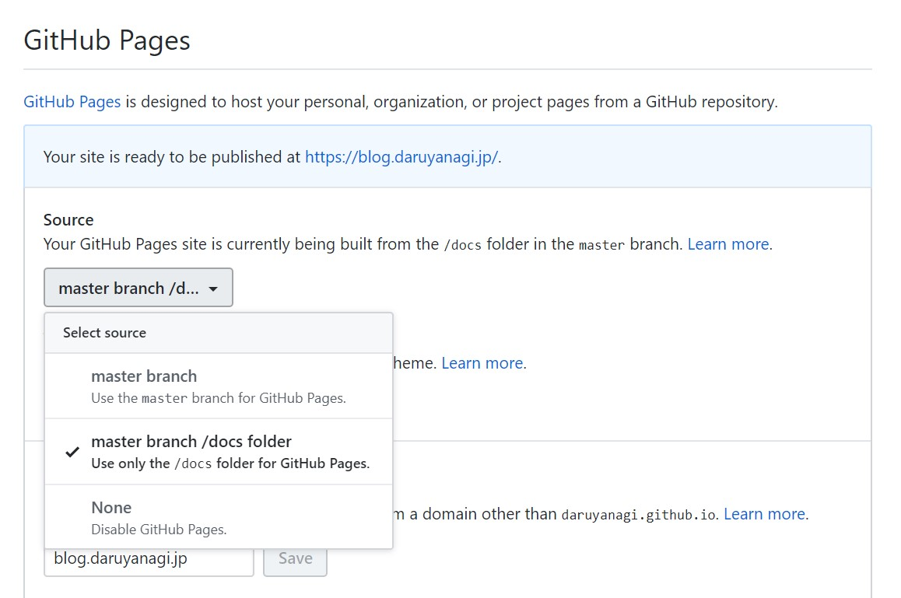

## Summary が長い

Hugo は Word で Summary をカウントするので（70ワードだったかな？）、空白で Word を区切らない日本語のような言語では Summary が異様に長くなる。設定ファイルを書き換えて、CJK 言語を利用していることを Hugo に教えてあげて解決。

    # config.toml
    hasCJKLanguage = true

## RSS がデカい

Hugo は RSS テンプレートを自分で書かないと、すべてのファイルを RSS に吐き出すようだ。設定を書き換えて、制限をかけてやる。

    # config.toml
    [services.rss] 
        limit = 10

## Markdown に埋め込んだ HTML がレンダリングされない。スクリプトが動かない

Hugo が使っている Markdown レンダラー goldmark　の初期値がサニタイズ有効になっている。設定を書き換えて、無効化してやる。

    # config.toml
    [markup.goldmark.renderer]
        unsafe = true

ただし、unsafe になるので扱いには注意。

## コンテンツの出力先を変えたい

GitHub Pages のソースを `/docs` にしている場合、ビルドしたコンテンツは `/public` ではなく `/docs` に吐きたい。設定を書き換えて、出力先を変えてやる。

    # config.toml
    publishDir = "docs"

