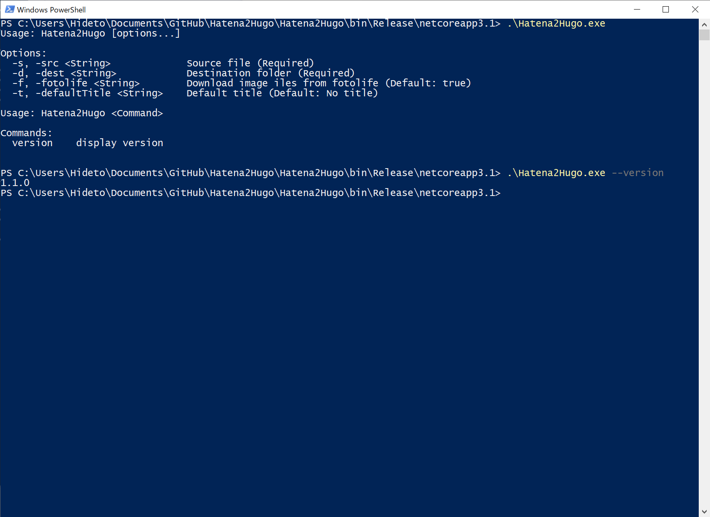

Hatena2Hugo v1.1.0 をリリースしました。

[https://github.com/daruyanagi/Hatena2Hugo/releases/tag/v1.1.0](https://github.com/daruyanagi/Hatena2Hugo/releases/tag/v1.1.0)

## 変更点

- バージョン情報を出力するスイッチ
- コンソール出力の改善
- ハードコードしていたデフォルトタイトルを起動オプションに
- リファクタリング

`fotolife` フラグを `string` ではなく `bool` にしたかったのですが、バインディングがちゃんと機能しない原因がよくわからなかったのでそのままです。まぁ、別にいいよね。
