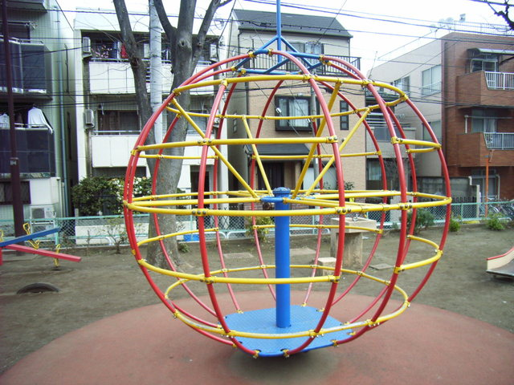
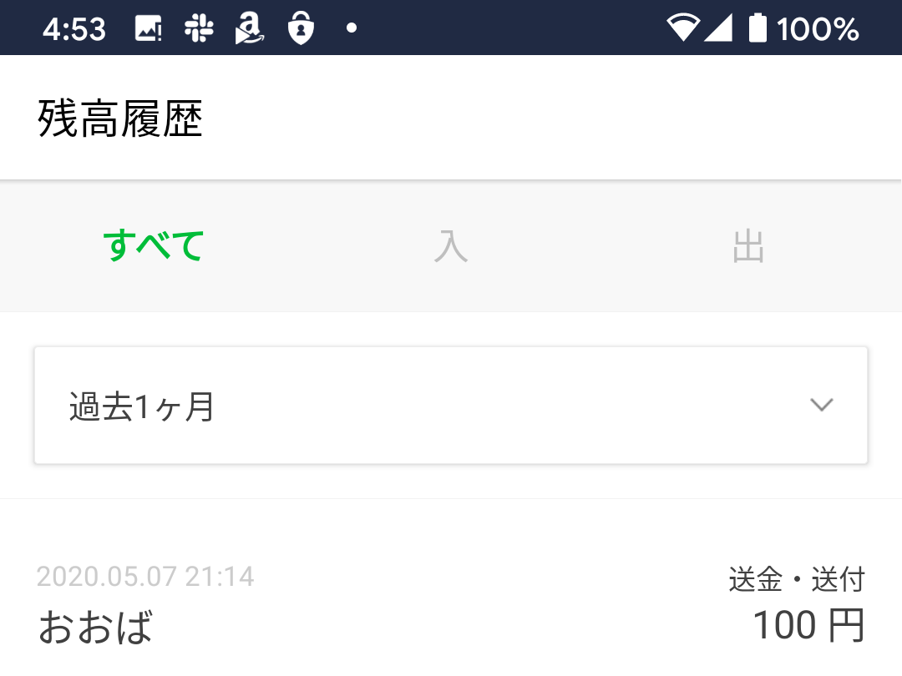

このエントリは @tworks の提供でお送りしております。

小さい頃に通っていた幼稚園[^1]にはグローブジャングルと呼ばれる回転遊具[^2]があり、自分はその天辺に上るのが好きだった。こういう遊具で戯れるとき、子どもたちは上ったり下りたり、中をくぐったり、回したりして遊ぶものだろう。自分もおそらくそれに交じり、同じようにして遊んでいただろうが、思い出すのはいつも、天辺でなにもせず、ただグルグルと回るに任せていたことだ。下にいるクラスメイトたちが遊具を回してくれるので、居ながらにして 360 度を睥睨することができる。幼稚園に設置されているものなのだから、たいした高さがあるわけでもなかろう。でも、10 人以上が群れて遊んで窮屈を感じなかったのだから、それなりには大きかったはずだ。当然高さもある。バカとなんとかは高いところが好きというが、当時の自分にはそこがお気に入りだった。これだけ高い遊具は、ときどき祖母が連れて行ってくれた中加賀屋の公園[^3]にしかない――今はもうないようだが、かつては結構な高さまで登れるチェーンネットがあり、大阪市の市章などをあしらった鉄のオブジェがぶら下がっていた。

[^1]: [学校法人住吉清水学園 加賀幼稚園](https://shimizu.ed.jp/kaga/)
[^2]: 自分がこの遊具の名前を知ったのは、つい先ほどのことである。
[^3]: [https://goo.gl/maps/cR3b8T7WxEZRGMc96](https://goo.gl/maps/cR3b8T7WxEZRGMc96)

ある日のこと。園庭に放し飼いにされた僕たちは、いつも通りこの回転遊具に取り付いていた。僕はさっそくいつもの場所を占め、ジャリンコどもが遊具を回すに任せていた。何人かのライバルたちが僕から玉座を奪おうと襲い掛かるが、四月生まれで平均より少しガタイのしっかりしていた僕の敵ではない。そのうち気分が高揚したのであろう、いつの間にか両手を放し、頂点で仁王立ちしていた。

そこから先はちょっと覚えていないのだが、たぶん他の子が突進してきたか、遊具に衝撃が加わって足を滑らせたのか。気が付くと、立ったままの状態からストンと下に落ちていた。鉄の格子に頭が挟まり、ぎゅうぎゅうと締め付ける。泣きはしなかったが、喚きはしたのだろう。先生が数人、血相を変えて駆け寄り、引き抜こうとしたり、引っ張り上げようとしたり……そのたびに格子は頭に食い込み、痛みが増す。どうにかこうにか頭が抜けたときは、みんな疲労困憊だった。

今思えば、挟まったのは肩のあたりかもしれない。けれど、記憶の中では「頭」だ。小さな頃は、よく親類から頭が大きいとからかわれ――今も残ってるかわからないが、当時の写真を見ると確かに大きい――、今でいうところのコンプレックスになっていた。当時はちょっと気にしていただけだったが、この事件はさすがに身に堪えた。ここに体を挟んだのは、園児数多しといえども自分くらいなものだ。頭が大きい自分は、頭を挟んだのだ。みんなはすり抜けるのに、僕の頭だけは引っかかるのだ！

このコンプレックスは、体が成長し、頭の大きさとどうにか釣り合いがとれぬこともないほどになるまで、長く僕を悩ませた。今は顔がデカい、態度がデカいと言われるが、痛痒を感じない。コンプレックスを乗り越えた自信が、今の自分に力を与えているのだ。

---

それはともかく、幼少の自分は自分のテリトリーにこだわり、自分で決めたルーティンを守ることに楽しみを見出していたらしい。

僕が通っていた幼稚園は粉浜の自宅から少し遠く――3歳までは北加賀屋の方に住んでいたらしいので、もともとは近かったのだろうが――、毎日の通園には幼稚園の専用バスを使っていた。うちの場合、マンションの隣にあった材木屋さんの前が送迎ポイントになっており[^4]、一つ下の弟とはバスを待つ間やバスから降りた後、よくその材木屋に忍び込んで遊んでいた。忍び込むといっても、オープンな倉庫にたくさんの材木が立てかけられている感じで、入ろうと思えばだれでも入れたろう。工場のひとも、イタズラなどをしない限りは、ジャリがちょろちょろしてる分には何も言わなかったようだ。今思えば、材木が倒れたりすることもあるわけで、安全衛生規則の面でどうだったのだろうと思わなくもないが……古き良き時代というヤツか。

[^4]: 現在はなくなって、違う会社の事務所になっている。[https://goo.gl/maps/edZenG3dywJsyii47](https://goo.gl/maps/edZenG3dywJsyii47)

さて、この送迎バスには1つのルールがあった。助手席を占めた園児が、好きなカセットテープ（！）をかけられるという特権を得ることができるのだ。マイクロバスの助手席というのは眺めがよく、ただでさえ競争率が高い。加えて、車内の BGM までを支配できるとなれば、それはまさに玉座だろう。うちの送迎ポイントはルートの真ん中ほどにあったので、行きしなは当然、他の園児が助手席を占めている。しかし、帰りの便はみな一緒に乗るのだから、チャンスは平等だ。僕は持ち前の体格と、でかい頭に詰まった小賢しさを総動員し、時計の針と先生の所作から帰りのバスが解放されるタイミングを計り、常に有利な場所を占位した。先生が長々と帰りのあいさつを始めようものなら、こっそりと席を外し、教室のドアににじり寄る。玄関までの最短ルートはもちろん頭に入っていたし、なんなら体を限界まで傾けてカーブを全速力で駆け抜ける術も身に着けていた。

助手席を占めると、リクエストするのは常にキン肉マンの歌である。

>   Go! Go! Muscle!  
>   
>   リングに稲妻走り　炎の戦士を てらす  
>   飛び散れ キン肉ビーム　勝利に向って

今聞くと「筋肉ビームってなんやねん」って感じではあるのだが、当時の自分はこれがお気に入りだったのだ。

[キン肉マン\(Kinnikuman\) OP1 \- YouTube](https://www.youtube.com/watch?v=gL5mctV7bhY#embed)

しかし、在位40日を超えて毎日キン肉マンの歌を聞かされる側は溜まったものではなかったろう。日々蓄積された鬱屈は、ある日とうとう爆発した。

いつものように送迎バスめがけて飛び出した僕は、数人に園児に取り押さえられる。自由にならない四肢。網膜にうつるは、陥落する王座。これがクウ・デ・タアというヤツか。僕は生まれて初めて、歯噛みというヤツをした。――私にどんな罪が？　お前たちも最初はキン肉マンの歌を聞いて、合唱していたではないか！

それからのこと、僕は送迎バスの助手席に執着しなくなった。その日、帰りのバスでどんな曲が流されていたのか、今でも思い出せない。

---

ちなみに、僕の頭をサンドイッチした件のグローブジャングルは、事故からほどなく撤去されたようだ。卒園後、弟を迎えるため親とともに幼稚園を訪れると、園庭には代わりに巨大な丸太のアスレチックが建立されていた。一つか二つ下の園児たちが、柱をよじったり、ロープにつかまったり、つり橋を渡ったりと微笑ましい。小学生に上がった僕は、目から血を流しながら世話になった先生に挨拶をし、園の発展を言祝いだ。

### 付記

繰り返しになりますが、

このエントリは @tworks の提供でお送りしております。

100円の寄付、ありがとうございました。

「自粛中でつまらんから、何か面白いことを書け」みたいなことを言われたが、自分は吉本の芸人ではないので持ちネタなぞあろうはずもない。しかたなく、幼稚園の頃の思い出を少しばかり書いてみた。

<blockquote class="twitter-tweet">
 <a href="https://t.co/ux8Zy3jmF4">pic.twitter.com/ux8Zy3jmF4</a>
&mdash; おおば (@tworks) <a href="https://twitter.com/tworks/status/1259048253183520769?ref_src=twsrc%5Etfw">May 9, 2020</a></blockquote> 

100円では足が出るので、今度はシャトーブリアンを送ってほしい。