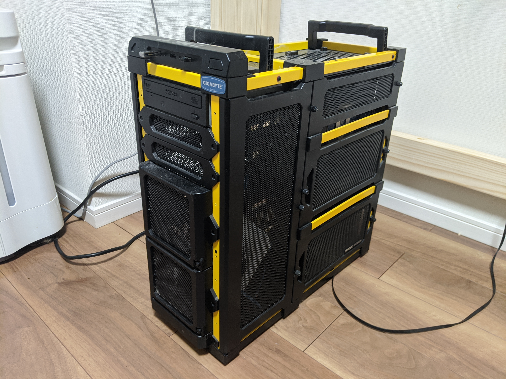
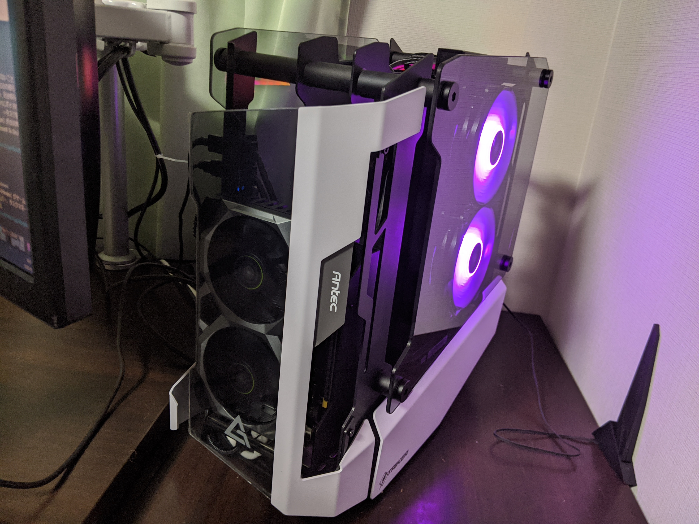
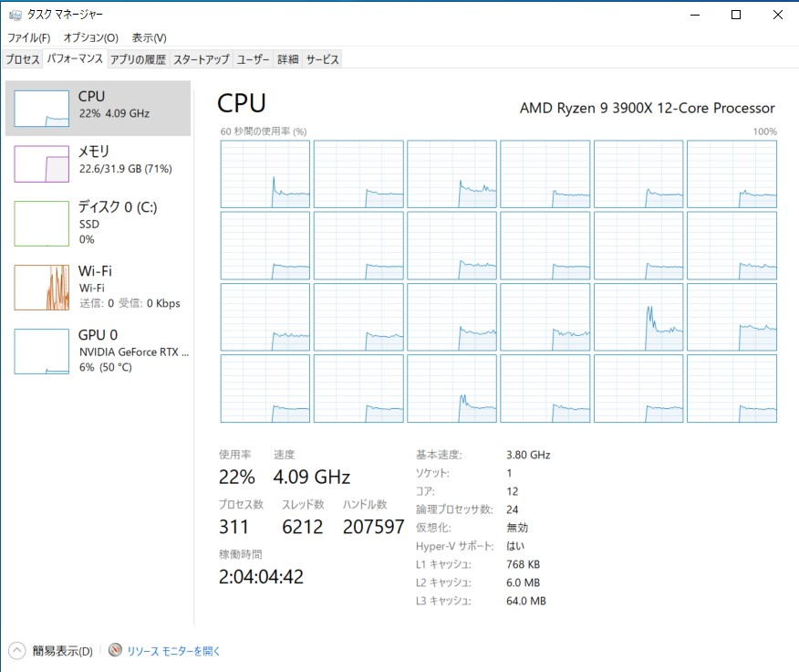
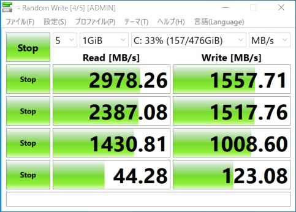

この前、仕事用のデスクトップ PC を新調しました。昔のブログ記事を紐解くと……実に8年ぶりのリプレースらしい。

[連休4日目。PCを自作した。 \- blog\.daruyanagi\.jp](https://blog.daruyanagi.jp/entry/2012/05/02/083431/#embed)

当時は Intel Core i5 3570T（IvyBridge）＋Intel B75（SSD 240GB、DDR3 メモリ16GB）という構成……その後、SSD を 500GB へ換装したり、貰い物の NVIDIA GPU を付けたりといったアップデートはしたものの、基本的にはずっとそのままの状態で使い続けていた。このままでも困らないといえばたいして困らないのだけど、Windows MR が動かない、リアルタイムレイトレーシング（RTX）未対応と、最新の技術にはまったく追いつけなくなってきていたし、そろそろどこかが壊れてもまったく不思議ではない。転ばぬ先の杖、そろそろ見切りをつけて移行したほうがよいだろう。

自作 PC 界隈はまったくの浦島太郎になってしまっているので、適当に BTO で組んでもよかったのだが、たまたま気に入ったケースをみつけたので、それをベースに組むことにした（3万円）。

[Amazon \| Antec Striker 強化ガラス搭載オープンフレームITX対応PCケース \| ANTEC \| PCケース 通販](https://www.amazon.co.jp/ANTEC-Striker-Mini-Antec-Striker-%E5%BC%B7%E5%8C%96%E3%82%AC%E3%83%A9%E3%82%B9%E6%90%AD%E8%BC%89%E3%82%AA%E3%83%BC%E3%83%97%E3%83%B3%E3%83%95%E3%83%AC%E3%83%BC%E3%83%A0ITX%E5%AF%BE%E5%BF%9CPC%E3%82%B1%E3%83%BC%E3%82%B9/dp/B07XF75BP3#embed)

サイドパネルが強化ガラスでできていて、スケスケでカッコいい。もともとオープンフレームの PC が好きだしね（そういえば、先代の PC も Antec のオープンフレームだったな）。マザーボードは mini-ITX になってしまうけれど、先代の PC は Full ATX だったにもかかわらず、結局 GPU 以外は PCI スロットが埋まらなかった。拡張性は思い切って犠牲にしてしまってもたいした問題はなかろう。

ガワが決まれば、あとは中身だ。CPU は最近流行りの AMD Ryzen にすべきだろう。Ryzen Threadripper はやり過ぎとしても、12コアの世界は体験してみたかったので、グレードは Ryzen 9 をチョイス。CPU クーラーを選ぶのが面倒だったので、最初から付いてくる 3900X にした（約6万円）。

[Amazon \| AMD Ryzen 9 3900X with Wraith Prism cooler 3\.8GHz 12コア / 24スレッド 70MB 105W【国内正規代理店品】 100\-100000023BOX \| AMD \| パソコン・周辺機器 通販](https://www.amazon.co.jp/AMD-Ryzen-3900X-105W%E3%80%90%E5%9B%BD%E5%86%85%E6%AD%A3%E8%A6%8F%E4%BB%A3%E7%90%86%E5%BA%97%E5%93%81%E3%80%91-100-100000023BOX/dp/B07SXMZLP9/ref=pd_aw_sbs_147_1/356-0201974-2922773?_encoding=UTF8&pd_rd_i=B07SXMZLP9&pd_rd_r=6652e64d-e7d1-4b45-b4d0-8ba4d0ef8a4b&pd_rd_w=rsQwP&pd_rd_wg=Wyvlt&pf_rd_p=bff3a3a6-0f6e-4187-bd60-25e75d4c1c8f&pf_rd_r=ZQC33XSQMSJ875XB9KCF&psc=1&refRID=ZQC33XSQMSJ875XB9KCF#embed)

GPU は RTX には対応しておきたいので GeForce RTX 20 シリーズは外せない。ケースの見栄えを考えるなら、できるだけゴツくてピカピカしたヤツがいいのだけど、今回は予算の関係もあったので GeForce RTX 20 シリーズで一番安く売っていたものを選んだ（4万円弱）。あまり格好のよい GPU ではないが、仕方ない。

[Amazon \| MSI GeForce RTX 2060 VENTUS XS 6G OC グラフィックスボード VD6915 \| MSI \| パソコン・周辺機器 通販](https://www.amazon.co.jp/gp/product/B07PM3L7QF/ref=ppx_yo_dt_b_asin_title_o06_s01?ie=UTF8&psc=1#embed)

本当は AMD で揃える方がいいのかもしれないが、今のところ選択肢がないから仕方ない……CPU が GPU 内蔵であれば、当面はそれで我慢して次世代の Radeon を待つという手もあったが、生憎 Ryzen 9 3900X は GPU を内蔵していなかった。

マザーボードは安心安全の ASUS をチョイス。チップセットは X570 と B450 の2つがあるみたいだが、たいした違いはなさそうなので安い B450 を選んでおいた（約1.5万円）。 

[Amazon \| ASUS AMD B450 搭載 AM4 対応 マザーボード ROG STRIX B450\-I GAMING 【Mini\-ITX】【 第3世代 AMD Ryzen CPU に対応】 \| ASUSTek \| パソコン・周辺機器 通販](https://www.amazon.co.jp/ROG-STRIX-B450-I-GAMING-%E3%80%90Mini-ITX%E3%80%91/dp/B07FKTSWNG/ref=sr_1_2?__mk_ja_JP=%E3%82%AB%E3%82%BF%E3%82%AB%E3%83%8A&dchild=1&keywords=ASUS+AM4+ITX&qid=1589186487&s=computers&sr=1-2#embed)

そのほか、メモリやストレージも購入。ストレージはせっかくなので Intel SSD 760p（M.2）にしておいた。最近の SSD って SATA ケーブルでつながないんだぜ……マザーボードに直接挿すんだぜ……（1.5万円×2＝約3万）。

[Amazon \| CFD販売 デスクトップPC用メモリ PC4\-21300\(DDR4\-2666\) 16GB×2枚 288pin \(無期限保証\)\(Crucial by Micron\) W4U2666CM\-16G \| Crucial\(クルーシャル\) \| メモリ 通販](https://www.amazon.co.jp/gp/product/B07584SLY8/ref=ppx_yo_dt_b_asin_title_o07_s00?ie=UTF8&psc=1#embed)

[Amazon \| Intel SSD 760p M\.2 PCIEx4 512GBモデル SSDPEKKW512G8XT \| インテル \| 内蔵SSD 通販](https://www.amazon.co.jp/gp/product/B078VCGSKS/ref=ppx_yo_dt_b_asin_title_o07_s00?ie=UTF8&psc=1#embed)

電源も買って、全部で18万円ちょっとになったけど、まぁ、妥当な線かなぁと思う。

ざっくり組んでみたのだけど、とくに初期不良なども見当たらない。ケースの構造が複雑なのには難儀したが、すんなり組めたと思う。GPU のライザーカード（このケースはライザーカードで GPU を引き回し、前面にディスプレイする仕組み）の刺さりが甘かったのか、最初起動しなくて焦ったけど……マザーボードに直接挿したらちゃんと動いたので一安心。

けれど、ちょっと問題も発生。

CPU クーラーの背が高すぎて、サイドカバーが閉まらない。まぁ、薄々そうなるんじゃないかなぁ、と思っていたので余りショックではなかったが……ゆくゆくは水冷 PC にしたいという思いもあってこの PC ケースを選んだのだし、空冷の CPU クーラーはその場のつなぎ、始動テストの時だけ動いてくれればいいやと思っていたし。そのまま使い続けてもいいが、本格水冷の前に簡易水冷を試してみるのも一興かと思い、追加で適当なクーラーを注文した。

[Amazon \| DEEPCOOL RGB LED Lighting対応 簡易水冷CPUクーラー \[Intel/AMD両対応\] GAMMAXX L240 V2 \| DEEPCOOL \| CPUファン 通販](https://www.amazon.co.jp/gp/product/B07QFWQXZ1/ref=ppx_yo_dt_b_asin_title_o04_s00?ie=UTF8&psc=1#embed)

「簡易」というだけあって設置は超簡単。配線でちょっと混乱しかけたけど、何も問題なく動いた。ピカピカ光っててカッコいい（低 IQ

ありとあらゆる部分がめちゃ高速になって大満足。ほぼ無音だった先代に比べ、だいぶファンがやかましくなったのには閉口するが……これは本格水冷でおいおい解決したい。

## まとめ

|              | 先代                              | →   | 新作                       |
| ------------ | ------------------------------- | --- | ------------------------ |
| CPU          | Intel Core i5 3570T             | →   | AMD Ryzen 9 3900X        |
| CPU Cooler   | Thermaltake Silent 1156 CLP0552 | →   | DEEPCOOL GAMMAXX L240 V2 |
| Chipset      | Intel B75 (ATX)                 | →   | AMD B450 (Mini-ITX)      |
| RAM          | DDR3 PC3-10600 8GB×2            | →   | DDR4 PC4-21300 16GB×2    |
| GPU          | (→ GeForce GTX 680)             | →   | GeForce RTX 2060         |
| Storage      | SATA SSD 240GB (→ 500GB)        | →   | M.2 SSD 512GB            |
| Power Supply | 700W 80 PLUS                    | →   | 750W 80PLUS PLATINUM     |
| Others       | DVD-R Drive                     | →   | -                        |