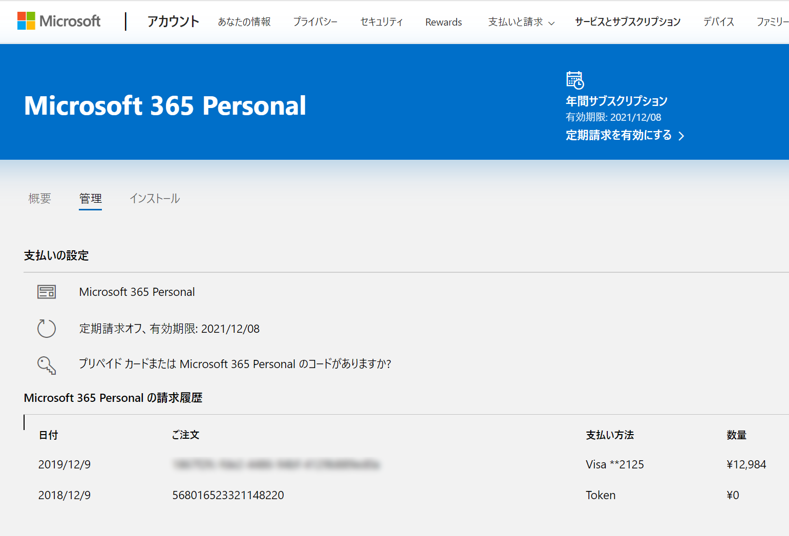

さくさん先生経由（＠ch3cooh39）で。

>   Microsoft 365 Personal 1年分と下記の3本を同時に購入することで、割引が重複されて 4,467円で購入することができた。
>   …
>   問題なく割引が重複されていたら下図のように請求額が 4,467円 になります。
>
>   [Microsoft 365 Personal 1年分を4,467円で購入する \- 酢ろぐ！](https://blog.ch3cooh.jp/entry/2020/05/11/232822)

[Amazon\.co\.jp： Microsoft 365 Personal\(最新 1年版\)\|オンラインコード版\|Win/Mac/iPad\|インストール台数無制限\(同時使用可能台数5台\): ソフトウェア](https://www.amazon.co.jp/exec/obidos/ASIN/B00O2TXF8O/ch3coohblog-22/#embed)

[Amazon\.co\.jp： ノートン ダークウェブ モニタリング Powered By LifeLock\|1年版\|オンラインコード版\|Win/Mac/iOS/Android対応: ソフトウェア](https://www.amazon.co.jp/exec/obidos/ASIN/B07TBF6CKF/ch3coohblog-22/#embed)

[Amazon\.co\.jp： ノートン セキュリティ デラックス\(最新版\)\|3台・月額版\|サブスクリプション\(定期更新\)\(Amazon\.co\.jp限定\)\|iOS/Windows/Android/Macintosh対応: ソフトウェア](https://www.amazon.co.jp/exec/obidos/ASIN/B07K6MD61Y/ch3coohblog-22/#embed)

[Amazon\.co\.jp： Adobe Acrobat Standard DC\(最新PDF\)\|Windows対応\|1か月版\|サブスクリプション\(定期更新\): ソフトウェア](https://www.amazon.co.jp/exec/obidos/ASIN/B07T2CBQR6/ch3coohblog-22/#embed)

さっそくやってみたけど、確かにちゃんと 4,467 円で買える。

Microsoft 365 の方にも入手したコードを入力し、ライセンスが1年延長されたことを確認した。

今回の買い物についてきたノートン & Adobe 製品はサブスクリプション（定期購入）制なので、念のため Amazon の [ライセンスを管理](https://www.amazon.co.jp/dsv/licenses) 画面で確認。利用を開始しない限りは大丈夫みたいだが、定期購入を無効にしておくとよいかもしれない。

