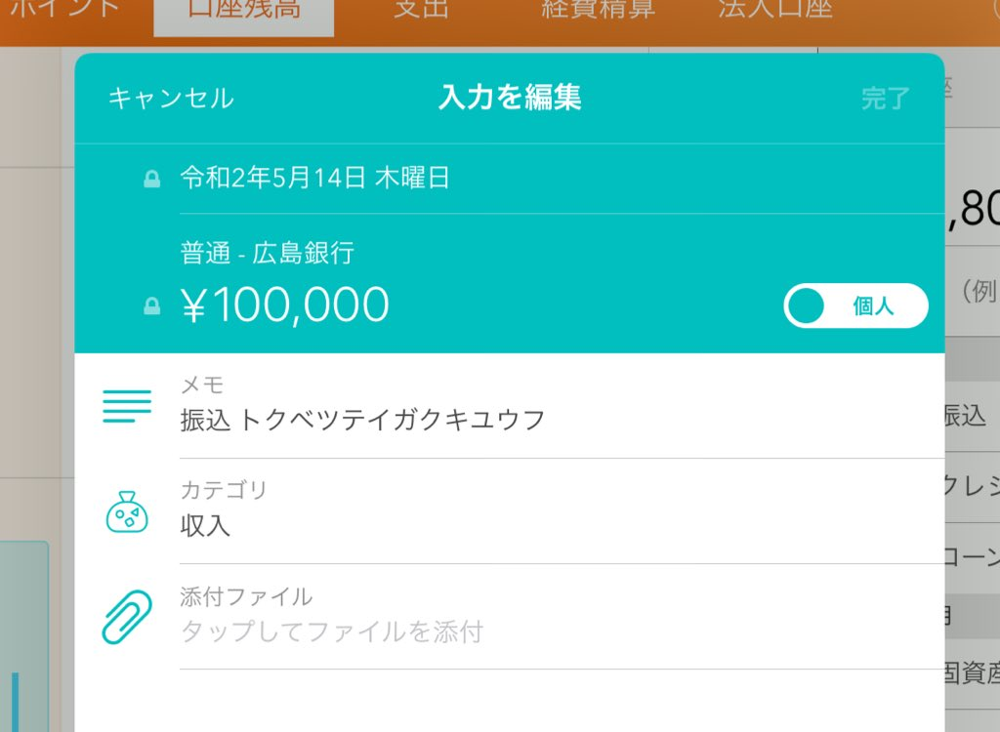
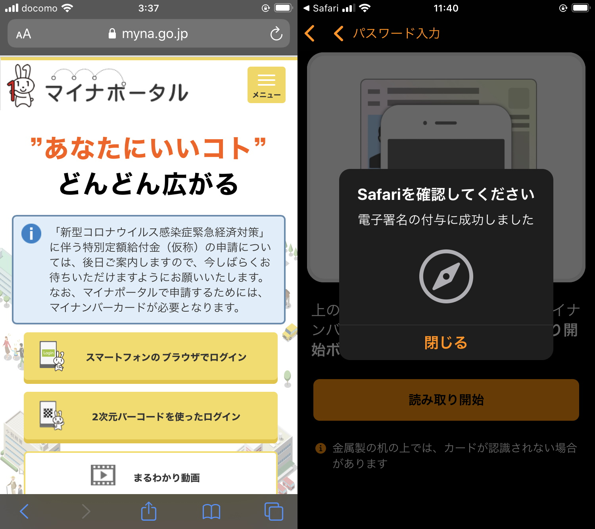

今朝、広島銀行の口座に特別定額給付金が振り込まれていた。5月1日にマイナンバーカードで iPhone SE 2020 から申請し、5月14日の入金。たった2週間でたいしたものだと思う。日本の役所の機動力には常々疑問を抱いていたけれど、やるときはやるのだなあと感心した。

## 特別定額給付金の必要性について

正直なところ、自分は COVID-19 の影響をあまり受けていないので、こういうものをもらうのはちょっと気が引ける。以前あった地域振興券、定額給付金の類は受け取りを辞退したし、今回もそうしようかと少し考えたこともあったが、結局はいただくことにした。自分はベーシックインカムに賛成だし――この制度はベーシックインカムにほど遠いが、余計な所得制限がなくシンプルで、網羅性のある点は少しだけ似ている――、マイナンバーカードの活用を実際に体験したいと思ったからだ。「経済を回せ」といった低俗な経済理論には興味がない。

今後のことを考えれば、こうした緊急性・即効性のある制度はあるに越したことはないだろう。今の自分にはあまり必要がなくても、「訓練」としては体験しておくべきだ。「アベノマスク」の配布もそうだが、緊急時にいきなり実施するといろいろ問題が出るわけで、こういうことは防災活動の一環として日頃からやっておけばよい。なんなら政府が必ず伝えたいことは「マイナポータル」経由で国民に送付し、全部読んだら現金やポイントを与えてもいい。政府が直接国民と繋がれるチャンネルはこれからも整備していくべきだ。

## 特別定額給付金の申請について

自分は iPhone でやったが、ものの 10 分程度で完了した。電子署名の付与で「マイナポータル」アプリと「Safari」を行ったり来たりする過程でエラーが一度発生したが、まぁ、これぐらいとやかく言うことでもあるまい。

ただ、アプリの切り替えは不慣れなユーザーにとって酷だろうな、と感じる。かくいう自分も、今触っているのが「マイナポータル」アプリなのか、「Safari」なのか、ちょっとわからなくなることがあった。そもそもアプリが切り替わっていることに気付かなかったり、アプリを切り替えるジェスチャー――OS のバージョンが上がるたびに複雑になっていってる気がする――を知らないかもしれない。iPhone にはカードリーダーが内蔵されているので、PC よりも楽かと思ったが、マルチタスクが視覚的にわかりやすいという点では PC に分があるのかもしれない。

あと、21世紀になったのだから、人類はいい加減パスワードぐらい扱えるようになってほしい。パスワード間違えて失効させた挙句、役所に押しかけて3密作るとか訳が分からぬ。脳みそのメモリ容量が足らないのを棚に上げて、システムを一方的に罵るのも醜悪極まりない。そういう人類に限って郵送を待つという知恵すらないのだから、本当にあきれるばかりだ。記憶力に障害があるケースもあるから簡単にはいかないが、「オンライン申請できる人には10万円、できない人には5万円」という制度設計にしてもいいと個人的には思う。5万円がかかってりゃ、サルでもパスワードを覚えるだろう。年額1万円のパスワード管理サービスを購入しても、ちゃんとペイする。

サービスの設計に問題があるのも確かだが、国民はもっと IT リテラシーを高めていくべきだ。多少の負担にはなるが、役人を雑務から解放して、より重要な職務にリソースを集中することができるかもしれない。それは国民にとっても望ましいことだ。自分も手の届く範囲でそれに協力していこうと思った。

