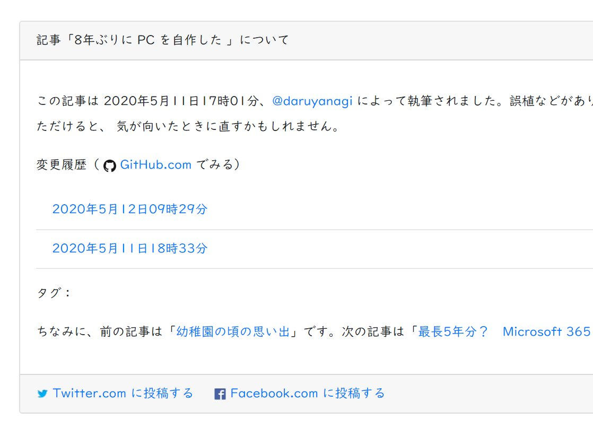

GitHub は API 経由で特定ファイルのコミットログを取得できる。GET リクエストを投げるだけなので簡単そうだ。

[https://api\.github\.com/repos/daruyanagi/blog\.daruyanagi\.jp/commits?path=/content/entry/2020/05/12/0555/index\.md](https://api.github.com/repos/daruyanagi/blog.daruyanagi.jp/commits?path=/content/entry/2020/05/12/0555/index.md)

これを利用して、こんな感じの編集履歴画面を Hugo のブログ記事に埋め込みたいと思った。



```golang
{{- $json := getJSON $endpoint -}}
<ul class="list-group  list-group-flush">
    {{ range $json }}
        <li class="list-group-item">
        <a href="{{ .html_url | safeURL }}">
            <time class="text-mute" datetime="{{ .commit.author.date }}">
                {{ (time .commit.author.date).Local.Format "2006年1月2日15時04分" }}
            </time>
        </a></li>
    {{ end }}
</ul>
```

なかなかうまくいった。さっそくビルド＆プッシュして本番環境に反映させよう……としたところ。

<blockquote class="twitter-tweet"><p lang="ja" dir="ltr">すまんｗｗｗ <a href="https://t.co/HxmY4bczAQ">pic.twitter.com/HxmY4bczAQ</a></p>&mdash; BLゲームの破滅フラグしかない だるやなぎ に転生してしまった… (@daruyanagi) <a href="https://twitter.com/daruyanagi/status/1260746364863967232?ref_src=twsrc%5Etfw">May 14, 2020</a></blockquote> <script async src="https://platform.twitter.com/widgets.js" charset="utf-8"></script> 

リクエストが多すぎるというエラーをもらってしまった。ウチのブログ記事は 2,000 ちょいあるが、それが一斉に API を叩いたものだから……そりゃあね。

というわけで、いいアイデアだと思ったのだが、残念ながお蔵入りとなってしまった。間にサーバーを挟んで、キャッシュ＆API を叩く間隔を調整してもいいが、さすがにちょっと面倒くさいかな。

## 参考

[Using GitHub API to retrieve all versions of a specific file \- Stack Overflow](https://stackoverflow.com/questions/16700297/using-github-api-to-retrieve-all-versions-of-a-specific-file#embed)