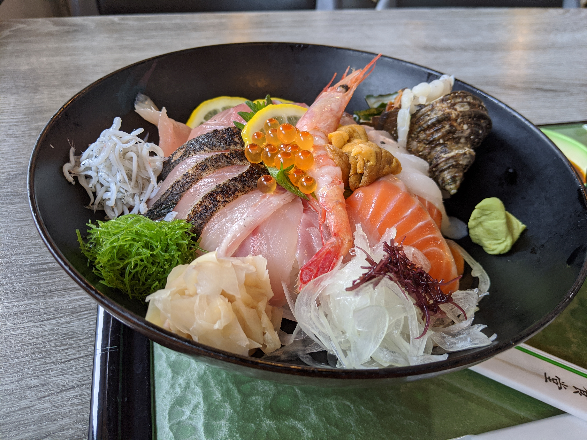

先日、愛媛県で新型コロナウイルス感染症の緊急事態宣言が解除されたので、週末はちょっと遠出することにした。市外へ出るのは、丸一ヵ月ぶりほどか。緊急事態宣言は解除されたものの、新型コロナウイルスの危険が去ったわけではないので、いわゆる3密を避けなければならない。近隣の県では「県外ナンバー狩り」なる恐ろしい犯罪も横行しているようなので、不要不急の越境も避けた方がよいだろう。

――というわけで、今回は愛媛県の端っこへ出かけることにした。

当初は佐田岬の旅館を予約していたのだが、「予約サイトではオープンになっているが、今月いっぱいは休みたいからキャンセルしてくれ」との連絡を受ける。こっちから予約サイトでキャンセルするとキャンセル料がかかるという注意書きがでるので、先方からキャンセル処理をしてほしいものだが、まぁ、そこは IT に不慣れなおばあちゃんがやってるのかもしれぬ。後で面倒なことにならねばいいなと思いつつも、こっちからキャンセルしておいた。

[【公式】えびすや旅館](https://hpdsp.jp/ebisuya/#embed)

やっぱりまだ外に出るべきではないのかのぅ……ちょっとテンションを下げながら、じゃらんをウロウロしていたら、以前に泊まったことのある愛南町のホテルが目についたので、次はそこを予約。結局、愛媛県西端への旅ではなく、南端への旅になった。

<blockquote class="twitter-tweet">
不要不急の県境越えを自粛するために、愛媛のギリギリ端まできた！ <a href="https://t.co/dXcW3A0Zvi">pic.twitter.com/dXcW3A0Zvi</a>
&mdash; BLゲームの破滅フラグしかない だるやなぎ に転生してしまった… (@daruyanagi) <a href="https://twitter.com/daruyanagi/status/1261545751953289216?ref_src=twsrc%5Etfw">May 16, 2020</a></blockquote> 

ホテルはほぼ貸し切りで、夕ご飯と朝ごはんの2回、大食堂でポツンと食べるのは少々寂しかった。でも、3密を避けるにはもってこいともいえる。瓶ビールを頼んだ以外には給仕もない。

このホテルは安い割にご飯のボリュームもあり、なかなかリーズナブルだ（今回は1泊2食付きで 5,500 円）。古さは否めないものの、掃除も行き届いている。前回泊まった時は、小学校か中学校のスポーツ少年団が泊っていたのか、なかなかに賑やかだったが、今回はたいへん静かだった。カエルの鳴き声とともに眠りに落ち、鳥のさえずりで目を覚ますなんて何年振りか。

[ホテルセレクト愛媛愛南町 \- 宿泊予約は【じゃらんnet】](https://www.jalan.net/yad308968/?vos=evjlnpg0022&cxlt=n7lqmdjzmvlsm2k02zw2y82hq2ng&pog=mt_b_kw_aud-116133660991:dsa-285428089430_dv_c_cr_289749757875_gp_27224191642_cm_357375922&gclid=EAIaIQobChMIgOf3t4u96QIVbdOWCh0xlQ5eEAAYASAAEgJVVfD_BwE&gclsrc=aw.ds#embed)

Google マップのタイムラインにはザックリとしか記録されていませんでしたが、今回の行程はこんな感じ。行きしなはあいにくの雨でしたが、山肌に張りつく霧、水平線を曖昧にする靄はなかなかの風情です。帰りは予想通りカッチリと晴れ、まさにオープンカー日和！って感じの天気だったので、二種類の景色を楽しめていい感じでした。とくに2日目はちいさな半島、細い山道なんかにも足を踏み入れて、ちょっとした冒険を楽しんでしまいました。S660 は軽自動車なので、細い道でも躊躇なく飛び込めていいですね。まぁ、それでも道が行き止まりになってたりすると大変なのですが……。

<blockquote class="twitter-tweet">
すげえ立派なワシ？ タカ？ <a href="https://t.co/xb0bndGZbO">pic.twitter.com/xb0bndGZbO</a>
&mdash; BLゲームの破滅フラグしかない だるやなぎ に転生してしまった… (@daruyanagi) <a href="https://twitter.com/daruyanagi/status/1261830521614512129?ref_src=twsrc%5Etfw">May 17, 2020</a></blockquote> 

<blockquote class="twitter-tweet">
S660 じゃないと走るのに気を使う細い道……これ以上、進むか悩む（ <a href="https://t.co/y3TvgkbTNV">pic.twitter.com/y3TvgkbTNV</a>
&mdash; BLゲームの破滅フラグしかない だるやなぎ に転生してしまった… (@daruyanagi) <a href="https://twitter.com/daruyanagi/status/1261838499616964609?ref_src=twsrc%5Etfw">May 17, 2020</a></blockquote> 

オープンカーで独りの旅行。宿・食事での応対を除けば、ほぼヒューマンと会うこともなく、なかなかの3密対策ができたのではないかな？　それでいて割かし楽しかったので、いい気分転換になりました。

<blockquote class="twitter-tweet">
わいの３密回避旅行  密接：一人旅。基本的に途中でヒューマンと触れ合わない 密閉：オープンカーで移動 密集：ホテルの大食堂でぼっち飯。ご飯が置かれていて、給仕もない（それでいい  おまけ：県外にはギリギリでない。お土産売れてなくて大変そうなので、無理しない程度に買う <a href="https://t.co/PszVnFEZvt">pic.twitter.com/PszVnFEZvt</a>
&mdash; BLゲームの破滅フラグしかない だるやなぎ に転生してしまった… (@daruyanagi) <a href="https://twitter.com/daruyanagi/status/1262182465226993664?ref_src=twsrc%5Etfw">May 18, 2020</a></blockquote> 

どうしても寄らなければならないところもあったのですが（トイレとか！）、かなりの対策がなされていたように思います。たとえば、着替えを持ってこなかったので、途中、宇和島のユニクロ（愛媛最南端！）で下着類を買ったのですが、おでこの検温に手の消毒、レジのソーシャルディスタンスと、考えうる限りの対策がしてあって感心しました。前回尋ねそこなって今回はぜひ！　と立ち寄った紫電改展示館でも、追跡のための住所・名前の記帳と手のアルコール消毒が義務付けられているようです。愛南のあたりは愛媛でも松山に次ぐホットスポットになっていたせいか、意識が高いですね。

途中食べた中では、八幡浜のどーや市場で食べた「どーや丼」がなかなかよかったですね。2,000 円という価格をどう評価するかは人それぞれかもしれませんが、「めいいっぱい海鮮を食べた！」って感じがします。海鮮丼って、そうじゃないとね！

ニュースで鬼北町のキジ肉が売れなくて困ってると聞いたので、ついでに1パックだけ確保できたのもうれしかったデス。

<blockquote class="twitter-tweet">
今回の旅行の成果 <a href="https://t.co/zBiUWnWBlD">pic.twitter.com/zBiUWnWBlD</a>
&mdash; BLゲームの破滅フラグしかない だるやなぎ に転生してしまった… (@daruyanagi) <a href="https://twitter.com/daruyanagi/status/1261940022187417601?ref_src=twsrc%5Etfw">May 17, 2020</a></blockquote> 