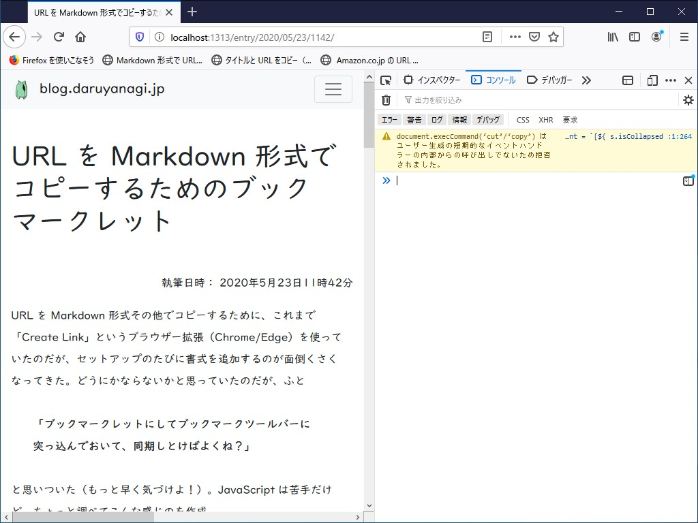

URL を Markdown 形式その他でコピーするために、これまで「Create Link」というブラウザー拡張（Chrome/Edge）を使っていたのだが、セットアップのたびに書式を追加するのが面倒くさくなってきた。どうにかならないかと思っていたのだが、ふと __「ブックマークレットにしてブックマークツールバーに突っ込んでおいて、同期しとけばよくね？」__ と思いついた（もっと早く気づけよ！）。JavaScript は苦手だけど、ちょっと調べてこんな感じのを作成。

```
var t = document.createElement("textarea");
var s = document.getSelection();
t.textContent = `[${ s.isCollapsed ? document.title : s.toString() }](${ document.URL })`;
var b = document.getElementsByTagName("body")[0];
b.appendChild(t);
t.select();
document.execCommand('copy');
b.removeChild(t);
```

EdgeHTML な「Microsoft Edge」ではうまくいかなかったが、「Google Chrome」なら以下のリンクをブックマークツールバーにドラッグ＆ドロップするとちゃんと機能するみたい。

<a href="
javascript:(function(){ var t = document.createElement('textarea'); var s = document.getSelection(); t.textContent = `[${ s.isCollapsed ? document.title : s.toString() }](${ document.URL })`; var b = document.getElementsByTagName('body')[0]; b.appendChild(t); t.select();document.execCommand('copy'); b.removeChild(t); })();">Markdown 形式で URL をコピー</a>

あとは必要な書式をいろいろ作って、ブックマークツールバーに入れておけばよさそう。たとえば、うちの Hugo ブログには Markdown URL の末尾に `#embed` を付けるとリンクを「はてなブログ」のブログカードっぽいリッチな形式に展開して貼り付ける Render Hook を自作して導入しているので、それ用のブックマークレットも作っておいた。

<a href="
javascript:(function(){ var t = document.createElement('textarea'); var s = document.getSelection(); t.textContent = `[${ s.isCollapsed ? document.title : s.toString() }](${ document.URL }#embed)`; var b = document.getElementsByTagName('body')[0]; b.appendChild(t); t.select();document.execCommand('copy'); b.removeChild(t); })();">Markdown 形式で URL をコピー（#embed）</a>

あと、こんなのもあると便利。この形式で URL をコピーして Trello へ張り付けると、1行目をタイトル、2行目を概要にしたカードをサクッと作成できる（駄洒落じゃないよ！）。

<a href="
javascript:(function(){ var t = document.createElement('textarea'); var s = document.getSelection(); t.textContent = `${ s.isCollapsed ? document.title : s.toString() }\n${ document.URL }`; var b = document.getElementsByTagName('body')[0]; b.appendChild(t); t.select();document.execCommand('copy'); b.removeChild(t); })();">タイトルと URL をコピー（改行区切り）</a>

ついでに[以前作ったブックマークレット](https://blog.daruyanagi.jp/entry/2020/05/05/1049/)を改造して、Amazon の商品リンクもコピーできるようにした。

```
var tag = 'bestylesnet-22';
var name = document.getElementById('productTitle').textContent.trim();
var asin = document.URL.match(/([0-9A-Z]{10})/)[0];
var t = document.createElement("textarea");
var s = document.getSelection();
t.textContent = `[${ s.isCollapsed ? name : s.toString() }](https://www.amazon.co.jp/dp/${asin}/?tag=${tag}#embed)`;
var b = document.getElementsByTagName("body")[0];
b.appendChild(t);
t.select();
document.execCommand('copy');
b.removeChild(t);
```

<a href="javascript: (function() { var tag = 'bestylesnet-22'; var name = document.getElementById('productTitle').textContent.trim(); var asin = document.URL.match(/([0-9A-Z]{10})/)[0]; var t = document.createElement('textarea'); var s = document.getSelection(); t.textContent = `[${ s.isCollapsed ? name : s.toString() }](https://www.amazon.co.jp/dp/${asin}/?tag=${tag}#embed)`; var b = document.getElementsByTagName('body')[0]; b.appendChild(t); t.select(); document.execCommand('copy'); b.removeChild(t); })(); ">Amazon.co.jp の URL を Markdown 形式でコピー</a>

Amazon 以外のサイトだと警告を出すようにしてもいいかもね。

<a href="javascript: (function() { if (!document.URL.startsWith('https://www.amazon.co.jp/')) { alert('Use in amazon.co.jp'); return;} var tag = 'bestylesnet-22'; var name = document.getElementById('productTitle').textContent.trim(); var asin = document.URL.match(/([0-9A-Z]{10})/)[0]; var t = document.createElement('textarea'); var s = document.getSelection(); t.textContent = `[${ s.isCollapsed ? name : s.toString() }](https://www.amazon.co.jp/dp/${asin}/?tag=${tag}#embed)`; var b = document.getElementsByTagName('body')[0]; b.appendChild(t); t.select(); document.execCommand('copy'); b.removeChild(t); })(); ">Amazon.co.jp の URL を Markdown 形式でコピー（警告付き）</a>

## メモ

「Mozilla Firefox」だと __document.execCommand(‘cut’/‘copy’) はユーザー生成の短期的なイベントハンドラーの内部からの呼び出しでないため拒否されました。__ というエラーが出てしまうんだけど、ダメなのかな。ブックマークレットのモダン（？）な書き方もわからないし（今どき var でもなかるまい）、まだまだ精進しないといけないなぁ。

