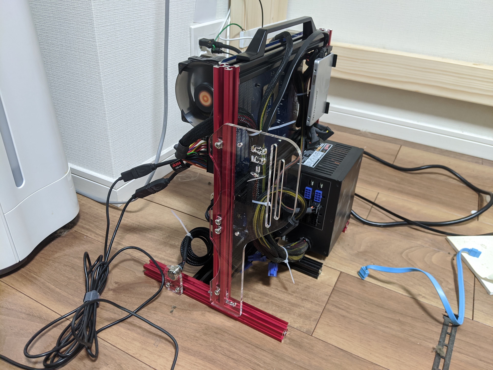
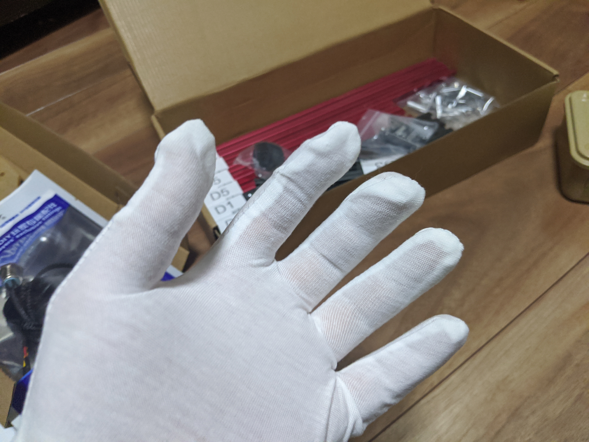

デスクトップ PC を新調したが、先代の PC もまだまだ働いてもらわねば困る。しかし、

- 3回の引っ越しを経て、ヘコミや歪みがでている
- グラボしか刺さってないのに、やたらでかい（古タワーケース

という難点があった。そこで PC だけ換装し、雰囲気だけでも一新することにした。

今回選んだケースはこれ。アクリルパネルの取り付け方を間違ってたりするけど、細かいところは気にしないでくれ。

ケースというよりホネだが、容積では半分近くコンパクトになっている。この PC は本格水冷のテスト機にでも使いつぶしてしまおうと思っているので（暇があればの話だけど）、こういうオープンフレームの方が内部にもアクセスしやすく、使い勝手がよかろう。

[オープンシャーシ マザーボードケース シャーシ カバー ATX/M-ATX/ITXオープンシャーシ 垂直 オーバークロック アルミニウム マザーボードケース フレーム シャーシラック(レッド)](https://www.amazon.co.jp/dp/B07ZGC5SL9/?tag=bestylesnet-22#embed)

ちなみに Amazon での価格は 9,679 円だった。どうも中国から送ってくるようで、届くまで少し時間がかかる。あと、Amazon には会社名すら書いてないんだが、一応 Qdiy という会社の QDIY PC-JMK5 という型番らしい。aliexpress からでも買える[^1]。

[^1]:後述するが、一部追加パーツは aliexpress からでないと買えない。

組み立てはそれほど難しくないが、慣れるまでは少々時間がかかった。イモネジはベースの小さな金具をフレームに入れる前に、一通り挿入しておくとよい。マザーボードをマウントする金具の位置は、あらかじめ型紙などを作っておくと決めやすそう……だが、自分は根本のネジは締めず、遊ばせておいて、マザーボード側を止めるにとどめた。まぁ、これでも強度的には問題はなさそう。

ちなみに手袋が付いてくるが、あまり質の良いものではないのでかえって工作の邪魔になる。ウエス代わりにすればよいだろう。

このケースにはいろいろ追加パーツがあるのだが、キャリングハンドルは是非お勧めしたい。これがあるだけで、持ち運びが大変楽になる。

[オープンシャーシプラットフォームハンドル アルミ​​ニウム合金 テストプラットフォーム専用 コンピューターマザーボードシャーシシェルパーツ用 ハンドル 人間工学 使用簡単 取り外し可能](https://www.amazon.co.jp/dp/B081C7J3WH/?tag=bestylesnet-22#embed)

キャリングハンドルを取り付けるときは、ケースの組み立て前にフレームへ組み付けてしまうとよい。フレーム自体はどの向きでも組付けられるが、向きによってはキャリングハンドルを取り付けられなくなるためだ。

あと、ビデオカードを垂直にマウントするパーツは大変かっこいいので是非確保しておきたいが、これは aliexpress からでないと買えないようだ。

[QDIY PC JMK5 カスタムオープンアルミブロック水冷却プラットフォームのゲーム Pc マザーボードコンピュータフレームシャーシブラケット|PC ケース & タワー| - AliExpress](https://ja.aliexpress.com/item/32991965282.html#embed)

自分はフロントパネルなんかと一緒にまとめて注文しておいたが、こんなパーツでも送料込みで 10,000 円ぐらいした。もうちょっと安く買えるといいんだがなぁ……。

定期的にエアスプレーで掃除すればたいして誇りはたまらないし、なによりメンテナンス性がすこぶるよろしい。メイン PC のケースもこっちにしておけばよかったなぁ[^2]なんて思うぐらい、割と気に入っている。

[^2]:だったら無理して mini-ITX にしなくてもよかったんだが？

## おまけ

[ANTEC レイアウトを自在にカスタマイズ可能なオープンイエローフレームのモジュラーPCケース LANBOYAIR-YELLOW](https://www.amazon.co.jp/dp/B003WMX3SY/?tag=bestylesnet-22#embed)

先代の PC ケースも大変よいケースだった。宗教上の理由で密閉していない PC ケースを使えないといった理由がないなら、是非お勧めしたい……ところだけど、絶版なんだな。まぁ、ちょっと高めではあったし、仕方ないかもしれない。
