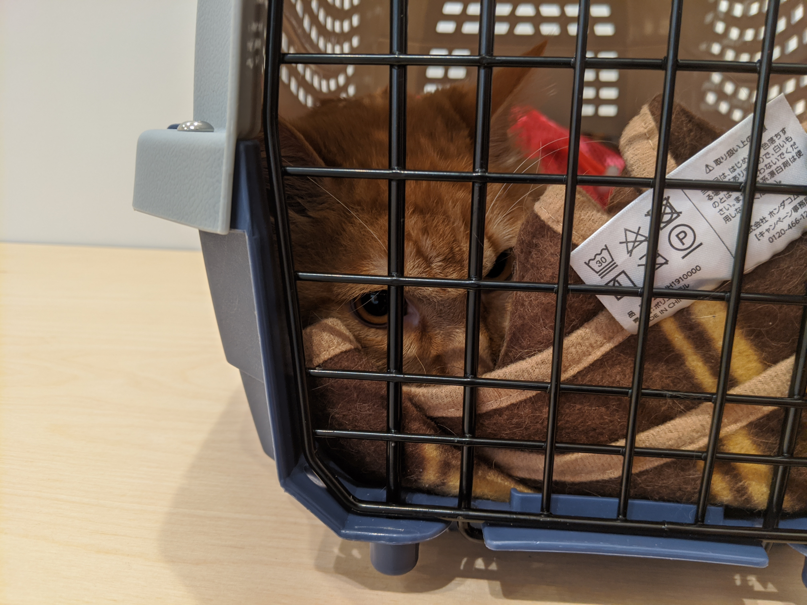

ねこやなぎをもらってきてから早半年。当初はまったく馴れてくれず、近づくだけでぐるぐる唸ったり、「シャーッ」と威嚇したり、噛んだり、引っ掻いたりと大変だったが、今では仕事を始めると膝の上にあがり、「撫でてくれ」と催促するまでになった。もちろん、これは自分が根気よく、愛情をもって接してきた成果だ。しかし、それだけではない。ここまで態度を軟化させるには、、彼らの活躍と貢献（？）は不可欠だった。

彼らがどこから迷い込んだのかはわからないが、ねこやなぎを保護先からもらってきたときからすでに幾ばくかはいたのであろう。冬から春先にかけて、彼らを目にすることはなかったが、5月に入って温度と湿気が夏らしさを見せ始めた頃から、その恰好の生態培養器のなかで増殖のペースを上げていたようだ。気が付いたときには、シャンプーのとき、首の毛の奥の方で赤黒いゴマのようなものがいくつもうごめいていた。

そう、ネコノミである。

>	ネコノミ（学名:Ctenocephalides felis）とは、ノミ目（隠翅目）ヒトノミ科に属する昆虫である。 成虫の体長はオス約2mmメス約3ミリメートルになり、ネコなど恒温性の小動物の体毛・外表皮に寄生し、口器を皮膚に刺して吸血する。飼育などで小動物と接触する機会があればヒトでも吸血する場合がある。特に猫に着くことが多い。  
>	
>	幼虫は体長2mm程で芋虫形状であり蛹で完全変態をなす。羽化した成虫は、寄生する動物が通りかかるなどで近くに来るまで待機し、二酸化炭素や体温などで動物の気配を察知すると狙いをつけ髙さ30センチメートル程跳躍する。 成虫のメス1匹が1日に10個程の卵を産み、生涯に凡そ1000個に及ぶ。産卵は体表面にされ、ネコの生活する場所の地表に落ちる。幼虫は塵埃のなかにある虫の糞便やフケのような有機物を餌にして成長する。  
>	
>	<footer><cite><a href='https://ja.wikipedia.org/wiki/%E3%83%8D%E3%82%B3%E3%83%8E%E3%83%9F'>ネコノミ - Wikipedia</a></cite></footer>

当初は、僕ものんびりを構えていた。ネコが痒みを訴えるので、ブラッシングしてやると喜ぶのである。ネコとの距離が急速に縮まり、僕がいるとブラッシングをおねだりするようになった。かわいい。

しかし、新型コロナウイルス感染症のせいで実りのなかった黄金週間が明けた頃から、ネコノミは生態培養器の飼い主にも牙をむき始めた。瞬く間に膝下がボコボコにかまれる。要所にノミ退治スプレーを撒き、掃除の頻度を上げ、なるべくこまめにやろうと心掛けるが、いっかな、ネコノミは減る気配がない。定期的なシャンプーには勤めていたが、シャンプーでは卵の類は落ちても、成虫を死滅させるには至らない。ヤツらは毛の奥にしっかり潜り込んで、櫛にもシャワーの水流にも耐えるのだ。

ねこやなぎの侵入区画を制限し、1日2回偽ルンバを稼働させていたが、とうとう寝床までがネコノミの手に落ちるに至って、ようやく決心がついた。**動物病院に連れて行こう。** 幸い、ねこやなぎはすでにデレデレである。[ミノムシ袋](https://blog.daruyanagi.jp/entry/2020/05/19/1724/)、[ネコマスク、ネコグツ](https://blog.daruyanagi.jp/entry/2020/06/03/1937/)などの新兵器の甲斐もあり、病院に連れて行っても迷惑をかけずに済むという自信が持てた。新型コロナウイルス感染症（COVID-19）に伴う緊急事態宣言もようやく解除された。ちょうどよいことに、徒歩10分程度の場所に新しい動物病院もできた。機は熟したというべきである。

メールで動物病院に予約を入れる。もし恐怖で脱糞したときに備え、カバンにはトイレシートとペット用ウェットティッシュを入れた。ついでに飼い主が重傷を負った時のことも想定し、山登りやキャンプで使っている救急医療セットも忍ばせておく。ペットキャリーには S660 を買ったときにおまけでもらったひざ掛けを敷き、数週間前から寝床として使えるように準備。飼い主の意図に反し、寝床としては活用されなかったが、ダイソンで掃除するときの緊急避難先として利用に慣れてもらった。3日前にはシャンプーも済ませ、考えうる限りの準備を行った。

とはいえ、失敗もあった。

通院当日は、ダイソンにビビッて避難する習性を逆手に取り、ネコハンモックでゴロゴロする ねこやなぎ は簡単にキャリーへ収まった。ここまではよい。

動物病院からの返信メールによると、暴れるネコは洗濯ネットにいれておくのがよいという。そこでミノムシ袋をかぶせてお尻をちょっと触ってやったのだが、かぶせ方が不完全だった。まんまと逃げられたのである。結局、再び捕まえるまでに小一時間かかり、最後は恐怖で脱糞までかましてくれた。カバンからペット用ウェットティッシュを引っ張り出し、嫌がる ねこやなぎ を抑えてお尻をふきふきするのにさらに30分。予定より大幅に遅れて、動物病院にたどり着いた。この病院は手術を除き予約は不要だということだが、なるほど、予約してもちゃんとその日時に来られるとは限らない（しつけが行き届いたペットは知らんが）。診療時間内ならいつでも受け付けてくれる外来制になっているのは合理的なことだ。

病院へは歩いて行ったが、ねこやなぎ はすっかりむくれて、キャリーの後ろの方に隠れている。おかげで重心が偏り、かなり持ちにくい。しかし、横断歩道をいくつかわたると馴れてきたようで、今度は前の方に移動して景色を物珍しそうに眺めている。おかげで重心が偏り、かなり持ちにくい。

病院はコミセン（松山市民なら誰でも知ってる、なじみのある場所だ）のそばで、真新しい。実は、独りで（ネコ付きだが……）病院に来るのは生まれて初めてだ。小学校3年生のころ、交通事故で病院送りになって以降、歯医者を除けば、人間の医者にも動物の医者にもかかったことはない。勝手がわからず不安だったが、とくに困ったことにはならなかった。

この病院はネコとイヌの待ち合わせ場所が分かれており、遠くからイヌがキャンキャン鳴いている（泣いている？）のが聞こえることに目をつぶれば、ペットの負担が少ない作りになっている。スタッフも親切で、モノのついでと質問攻めにする自分にも的確に答えてくれた。懸念だったねこやなぎも、借りてきたネコのようにおとなしい（まぁ、ネコなんだが）。いつも初対面にはかなり警戒し、ウーッだのシャーッだのうるさいのに、女性スタッフがやさしく声をかけながら、なでなでしてくれることに気をよくしたようだ。いつもの気概はどうした。その程度でやすやすとポリシーを変えてしまうのか、そんなにお姉さんが好きか。俺もお姉さんに頭なでなでされたういわ、クソが。

それはともかく、ネコマスクをポケットに忍ばせてきたが、カバンのなかの失禁対策グッズ、救急医療キットともども出番はなかったのは幸いだった。今回はワクチン、爪切り、さまざま諸々をしていただいて、初診料込みで 6,000 円ぐらい。もう一度ワクチンを打って、血液検査をパスしたら、ω もとってしまう予定だ。