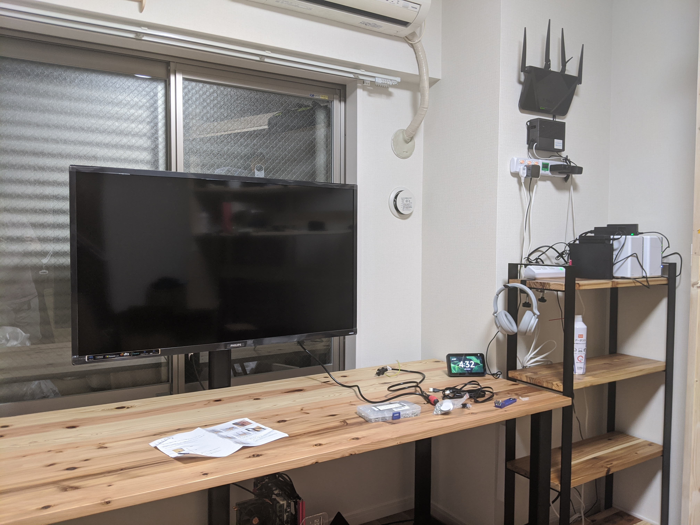
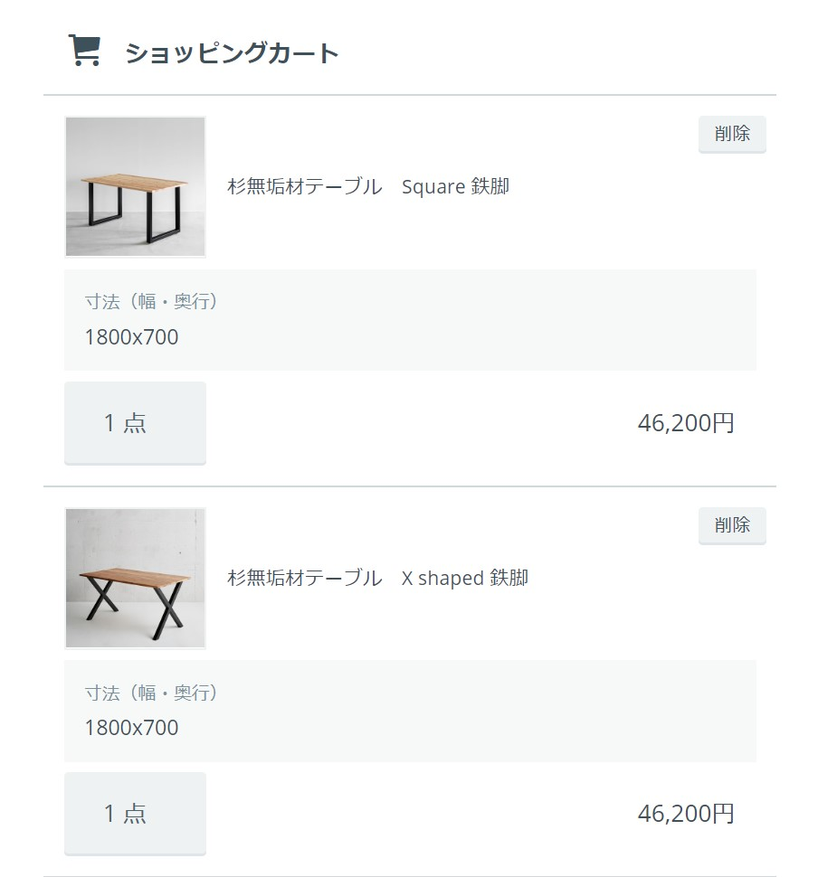
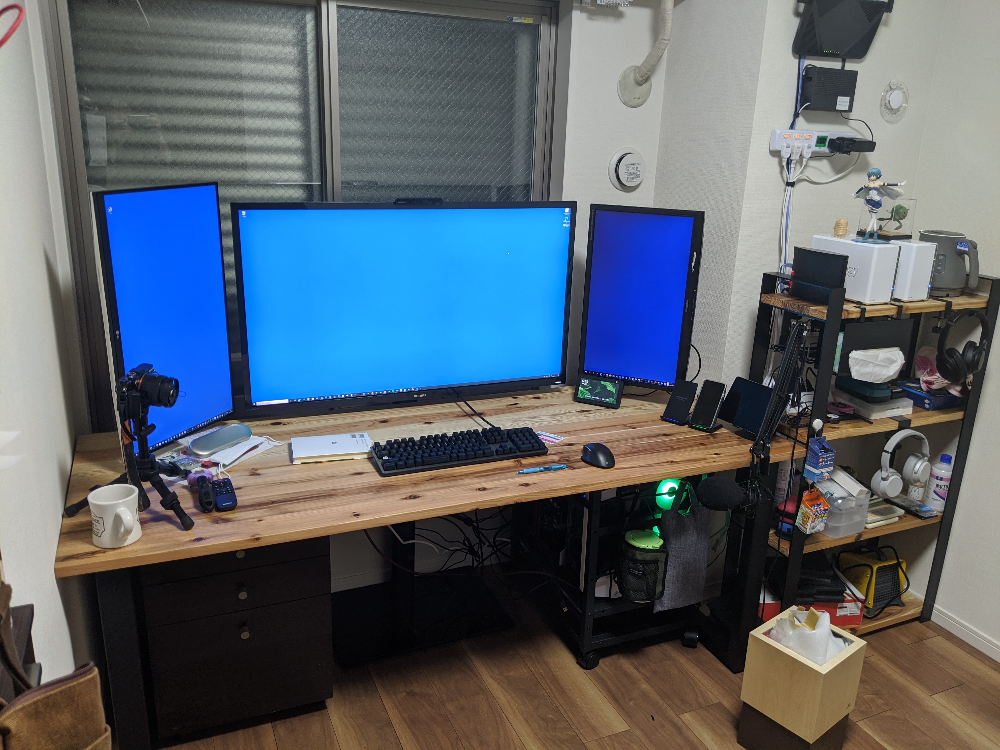

[特別定額給付金が振り込まれた](http://localhost:1313/entry/2020/05/14/1037/) ので、新しい机と棚を買った。国産杉、無垢材の板を使ったオーダーメイドのものだ。自分の場合、今回のコロナ禍による被害は、当面のところ30万円程度の売り上げ減で済んでいる（コロナのせいばかりとは言えないところもあるが）。事業存続の危機にある人たちを尻目に10万円ももらうのは少し気が引けるけれど、せめて国産を名乗るものを買うことで許していただくことにする。ついでなので、キャッシュレス消費者還元事業もフル活用。松山市は人口50万の割に仕事が早く、そうそうに特別定額給付金を配り終えたらしい。おかげで、6月末までの還元事業に十分間に合った。いまだに給付率が3割に満たないところもある中、えらいことだと思う。

メーカーは「かなでもの」というところをチョイスした。シンプルでモダン、金物と木が調和したおしゃれ数が揃っている。どっちかっていうとオフィス向けのようだ

[金物家具のかなでもの](https://kanademono.design/#embed)

今まで使っていた机は、親父から強奪した幅 160cm、奥行 80cm のモノだが、うちの書斎は窓に面したデッパリ部分が 180cm あり、20cm の隙間ができる。また、背面に幕板が伸びているのもいただけない。もともとは工事会社の事務室に置いてあった机なのだが、だだっ広い部屋にドンと置くのであれば、この幕板は足を隠すのによかった。しかし、今の我が家ではネコが入り込んで困る。単に入るだけならいいのだが、配線に絡まって進退不能になったり、暴れてコンセントを抜いたりする。そうなるといちいち机を引っ張り出して助け出さなければならなくなる。なので、幕板のない・足だけのシンプルな机にリプレースしたかったのだ。その点、かなでものの机はピッタリ。幅はオーダーメイド可能なので、部屋にぴったりと収まるモノが買える。机を置くと、その横に幅 68cm、奥行40cm ほどのスペースができるので、これに合う棚も同時に買った。これで〆て9万円ちょっと。

本当は脚を X 型にしたかった（かっこいいじゃん！）のだが、両サイドにディスプレイポール＋アームを立てる関係で、一番安定性の高そうな ロ の字型で我慢。それでもセンターに思いディスプレイを置くのはタワミが心配になるので、中央のディスプレイはウォールスタンドで支えることにした。……となると、中央のディスプレイはもっと大きいものでもいい。というわけで、ついでにモニターも 27 型から 42 型へリプレースすることにした。

[普遍的なTVの台紙が付いている100度の回転の高さの調節可能なそして19から42インチLCDのための傾き機能、LED OLED TVが付いている普遍的なTVの立場](https://www.amazon.co.jp/dp/B07RW6XZF2/?tag=bestylesnet-22#embed)

[PHILIPS モニター ディスプレイ 436M6VBPAB/11 (42.5インチ/「Display HDR 1000」認証/HDMI/USB Type-C/4K/5年保証)](https://www.amazon.co.jp/dp/436M6VBRAB/?tag=bestylesnet-22#embed)

モニターは USB type-C 対応以外にこだわりはなかったので、そのときたまたま安かったフィリップス製（7万円台）をチョイス。HDR1000 ってどんなもんかな！　って期待してたのだけど、実はいまだに使っていない。でも、デカさには満足。ウォールスタンド（6,899 円）も最低限の役目は果たせる品質でとくに文句はない。

まだごちゃごちゃしてるけど、快適なトリプルモニター環境が完成！　左のディスプレイは上部に Slack、下部に Trello を配置して連絡ボード代わりに。右のディスプレイは Twitter 専用。真ん中のモニターでお仕事をする感じだ。最初は画面がでかすぎるかなと思ったけど、PowerToys の FancyZone という機能を使うことで使い勝手がかなり向上した。これについては、またの機会に。

あとは裾上げを頼んだカーテンを装着し、背面の配線をきれいにするだけだ。

## 追伸

この机にしたおかげで、ネコに仕事の邪魔をされなくなった。ある日、机に飛び乗ろうとしたところ、ブライワックスクリアで仕上げられた天板で盛大にスリップして墜落し、カラダをしたたかに打ち付けたからだ。それ以降、僕の脚に体を擦り付けたり、椅子を引っ掻いて興味を引こうとはするものの、机の上にまできて邪魔することはなくなった。おかげで仕事の効率がちょっと上がった気がする。