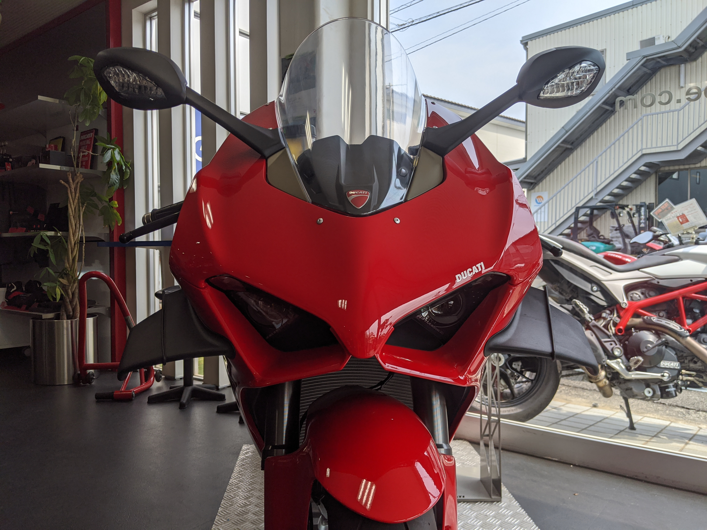
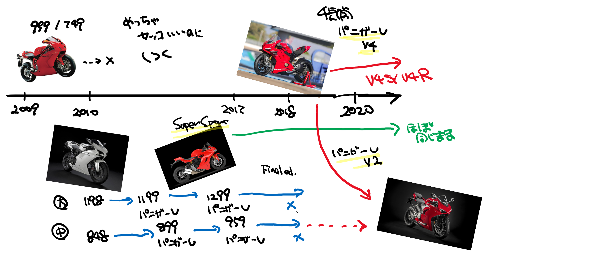
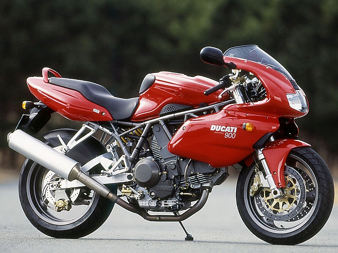
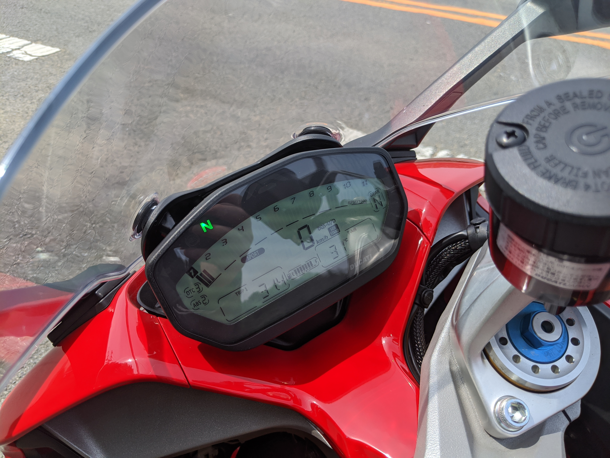

コロナでやることがないお盆休みの初日。バイクハウス阿部さんに電話をして、Ducati SuperSport の試乗予約をした。Ninja 250 は十分楽しんだし、年齢的にも Ducati のスポーツモデルに乗れるのは最後かなって思うので、少し前から乗り換えを検討していたのだけど、いろいろ調べてみるに（後述）、自分に一番マッチしているのは Ducati SuperSport らしい。Panigale V2 も気になるのだが、残念ながら先日試乗車が売れてしまったとのことで、今回は比較できなかった。気に入ったら契約する気満々だったが、一応ハンコは持たずに出かけた。今日は見積書だけもらって、家に帰る。

## 2009 年以降の Ducati のラインナップ

Ducati からは10年ぐらい離れていたので最近のことはあまりよくわからなかったのだけど、色々調べるに、今はこんなことになっていたらしい。

999（だいたい排気量 1L）をやめて 1198 系（約 1.2 L、ミドルクラスは 800cc～900cc ぐらい）を改善しながらずっと2気筒で頑張ってきたけど、国産の 1L 4気筒にどうしても勝てないので、とうとう宗旨替えして V4 を作った。2気筒はラインナップを中排気量に絞り、デザインも 1198 系から V4 のものにした……って感じだろうか。

SuperSport がいきなり登場するのは敬意がよくわからんのだけど、従来は「本気の人のためのフルサイズ、ライト層のためのミドルクラスのスーパーバイク」でカバーできてたところ、2気筒をカリッカリにしていく過程でミドルクラスですらライト層が追いつけなくなってきたので、もう少しツーリングフレンドリーにして取りこぼしたライト層をもう一度つかみにいった……って感じなんだろう。

ちなみに今買えるのは下の3つ。ほかにディアベルトかムルティストラーだとかいっぱいあるけど、そいつらは割愛。

- *Ducati Panigale V4*：新しい4気筒のスーパーバイクフラグシップ。260 万円ぐらいから
- *Ducati Panigale V2*：伝統の2気筒のスーパーバイクフラグシップ。225 万円ぐらいから
- *Ducati SuperSport*：オーリングのサスペンション付きの S モデルで 180 万ぐらいから

一度くらいはスーパーバイクに乗ってみたいなぁって思いはあったのだけど、たぶん公道では完全にオーバースペックなので、SuperSport が無難だよね。

## Ducati SuperSport

Ducati の SuperSport は以前にフルカウルの SS900 とハーフカウルの 750（乾式クラッチ苦手なので買い替えたｗｗｗ）を所有していたのでそれなりによく知ってるつもりだけど、新しい SuperSport は全然キャラクターが違ってた。

昔の SuperSport は足付きこそそんなに悪くないんだけど（わいは身長 168 cm）、なんせハンドルが遠くて、低い。ポジションは背の高い馬におぶさる感じで、初めて乗ったときはすごく怖かった――なんだかんだで、それが好きになってしまったんだけど。

それに比べると新しい SuperSport は今乗ってる Ninja 250 とあんまり変わんねえなって印象をうける。確かに乗りやすいんだけど、ちょっと甘やかしすぎかなぁ……ハンドルはもっと下でもいいと思う。まぁ、そんなこと言いだすとステップやらなんやらまで変えたくなってしまうのだが。

走り出しにはまったく問題がなくて、三津から高浜、免許センターまでの海沿いの道を気持ちよく走った。鼓動感はあるけれど動きはなめらかで、10年経つとこんなにもよくなるのかと驚かざるを得ない。途中で U ターンをしたが、かつてほど神経質にならずともスルッと回れる。これはいい！　断然ほしくなってきた。

シート高は 810mm で、足指の付け根が両方接地する程度。SS900 より 10mm 低いけれど、そこまでの足付きのよさはあまり感じなかったというか、SS900 の方が安心感があった気がする。この辺りは慣れもあると思う。

メーターは……針がねえ。でも、コンパクトながら結構見やすいかな？　ギヤポジションがわかること、ウィンカーの左右どっちがついているのかわかること（昔のって、ウィンカーがついていることしかわからんかった！！）あたりは、昔を思うと感動すら覚える。うちの子は燃料系の調子がおかしかったので、トリップメーターを見ながら走ったものだったが、このメーターなら残りの航続距離とかまで出せそう（そこまで余裕なくて、いじってないけど）。

股下の熱さは許容範囲。わざと昼過ぎの一番暑そうな時間帯に設定してみたけど、デニムでも不快ではなかった。けれど、「アイドリングで5分放置してると燃える」って警告シールが貼ってあるのは怖いなｗ

## Ducati Panigale V4

試乗後、アイスコーヒーをいただきながら涼んでいると、「Panigale V2 は試乗車がないのですが、V4 はあるのでいかがですか」とのお申し出があったので、甘えてみることにした。

SuperSport は性能要求が低めなせいか、全体的にシュッとしている。それに比べると V4 はいかにも「性能優先」って感じのマッチョなデザインだ。好みでいうと SuperSport の方が好きだが、フラグシップならではのインパクトはあって、やはり惹かれるところはある。

シート高は 835mm で SuperSport の25mm 増し。ここまでくると自分の短い脚では十分に大地に根を生やすことはできず、両足のつま先で辛うじて接地する感じだ。交差点でまっているとき足がつりそう……半ケツずらしすれば問題はないが、デニムがシートに引っかかると転倒の危険もある。真面目な装備で乗るべきだろうな。

メーターは液晶でカッコいいが、ハンドル周りのボタンが多く、乗り出した当初はあたふたしてしまった。エンジンはエンジンで軽くひねるだけでもりもりパワーが沸いてくるし、股の下は熱くて金玉がゆであがりそうだし、SuperSport に比べて気をつけなきゃいけないことが一気に増える。挙句の果てには、伊予鉄の踏切でエンスト（！？）までしてしまって、恥ずかしいやらなんやら……正直なところ、早く降りたいとさえ思った。

でも、梅津寺あたりを通るころにはだんだん慣れてきて、クルマがいなくなった好きに急加速と急減速を試すぐらいに余裕ができた。1速のままアクセルを全開にしようと思ったが、ぶっちゃけすぐ法定速度を超えてしまう。メーターは 15,000 回転ぐらいまであるんだけど、8,000 ぐらいまでしか回さなかった気がする。ブレンボのブレーキはタッチ・効きともに十分で、ABS もちゃんと機能した。スロットルのレスポンスやトラクションコントロール、ABS の強度なんかはフルカスタマイズできるみたいで、最近のバイクはすげえなって感想しかない。

で、もう一つ。 **クイックシフター最高！！** もうね、これのないバイクには乗りたくないですよ。SuperSport の試乗のときは勝手がわからず、ダウン側しか試せなかったけれど、V4 ではアップ側のクイックシフターも存分に試せた。クラッチレバーを握らなくても、左足でシフトペダルをくいっとあげるだけでギアが上がる。発進してスコスコスコッと3速まで上げるの楽しい。コーナーの前のシフトダウンもどえれえ楽しい。対向車線のバイカーが挨拶してくれたんだけど、左手がフリーなのでちゃんとサインを返せる。まぁ、極低速・停止寸前は自分で操作しなきゃだけど……今までどんなに自分がクラッチ操作をサボってきたかがわかる。無意識のうちに「めんどくさいからシフトダウンいいか～」とか思ってたんだよ。クラッチペダルを踏むだけでギア下げられて、気持ちよくレブマッチまでやってくれるんだから、これからは「めんどくさいのでやらない」なんて選択肢はもうないね。

新しい 4 気筒の Ninja 250 にはクイックシフターが設定されているみたいだけど、ぜひつけるべき！

そんなわけで、V4 に乗る前までは 8 割り方 SuperSport を買う気でいたのに、お店に戻った頃にはすっかり五分五分にまで判断が覆ってしまっていた。さすがに V4 では子どもが飛び出してきたときに対応できる自信がないし、買う気はない。でも、V2 だったらもう少し何とかなりそう……理性で考えるなら積載性が高い SuperSport 一択なんだが（キャンプツーリングとかしてえんだよ～）、気持ち的にはスーパーバイク（の端くれ）にも一度乗ってみたい。そうやってお店で1時間ぐらいうだうだ悩んでると、スタッフさんが言うのさ。

「今決めてくれたら、お盆明けに発送できるよう在庫を抑えます！」
「あ、契約にハンコは要らないっす」
「SuperSport の新車が入るのはたぶん来年です（試乗車を中古で買うことはできる」

そうこうするうちに意識がすうっと遠のいていき、気が付いた時にはローンの本人確認の電話をとって「ハイ、ハイ」と応える機会になっていた。

新しい愛車、Ducati Panigale V2 の納車日は9月初めの予定です。

## 追記

V4 のスタンドが最初下せなくて苦労した。シフトペダルに足を置いた状態でつま先を外に開き、足を少し後ろにずらしてそのまま下げると、踵にスタンドが引っ掛かって下りてくる（ことがある）。試乗するときは何回か練習しておくといいかもね。