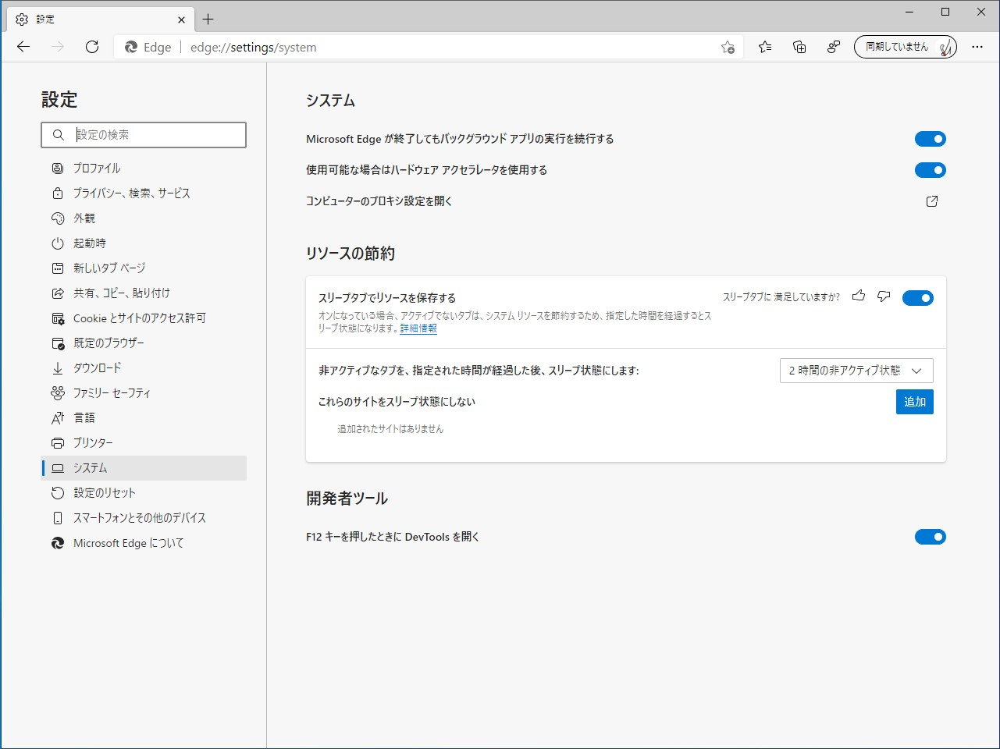
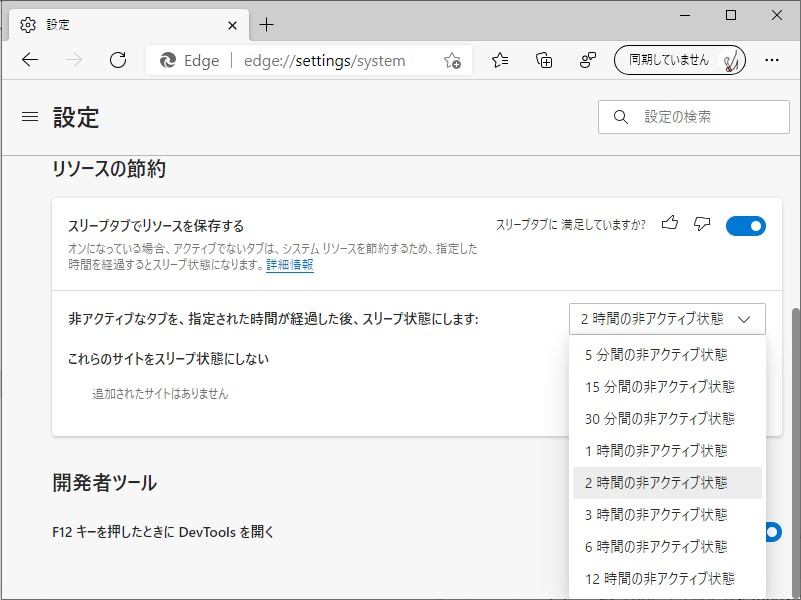
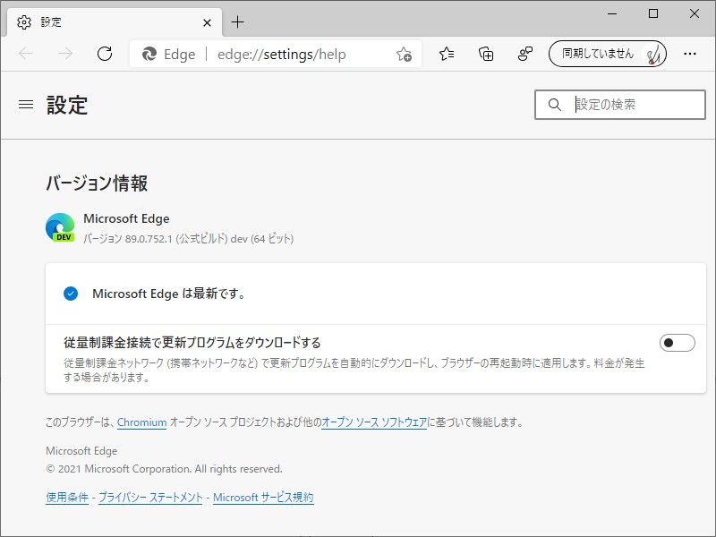
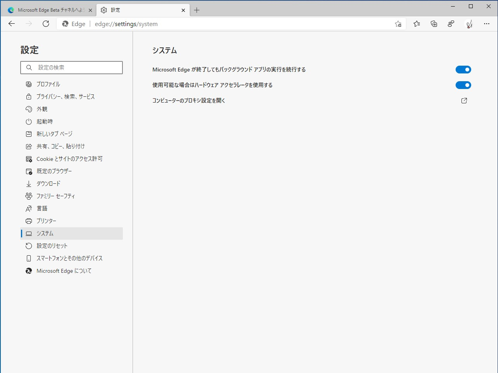

Dev チャネルの 「Microsoft Edge」（［設定］―［システム］―［リソース節約］）に［スリープタブでリソースを保存する］というオプションが追加されていた。

>   オンになっている場合、アクティブでないタブは、システム リソースを節約するため、指定した時間を経過するとスリープ状態になります。

指定した時間が経過すると、非アクティブなタブを自動でスリープ状態に移行させ、リソースを解放する機能のようだ。タブをスリープ状態にするまでの時間と、スリープタブを行わない除外サイトの指定も行える。バックグラウンドで自動更新するタイプの Web ページなんかは、除外指定しておいた方がいいのかもしれない。

地味なところだが、このバージョンでは［F12］キーを押したときに DevTools を開くオプションも追加された。旧 Edge は［F12］キーで開発者ツールが起動可能で、「F12 ツール」などとも呼ばれていたと思う。自分も［F12］キーで開発者ツールにアクセスするのに慣れているが、これが煩わしいと思う人は無効化できる（既定で有効）。ちなみに、［Ctrl］＋［Shift］＋［I］キー（Inspector の I だろう）でもアクセスできるので覚えておくとよいかも。Apple M1 対応も、デバイスを持ってる人にとってはうれしいのかな。うちの M1 Mac も常用は Canary → Dev に切り替えておいた。

[Apple Siliconネイティブの「Microsoft Edge」がDev版に ～Mac向けの独自機能も - 窓の杜](https://forest.watch.impress.co.jp/docs/news/1298889.html#embed)

あと、edge://settings/help に従量制課金接続に関するオプションも生えていた。旧 Edge は OS 側で制御する仕組みだったと思うけれど、新 Edge はここでコントロールしなきゃいけないようだ（既定は無効）。

[Dev channel update to 89.0.752.1 is live - Microsoft Tech Community](https://techcommunity.microsoft.com/t5/discussions/dev-channel-update-to-89-0-752-1-is-live/m-p/2037953#embed)

[Turn off F12 opening DevTools with new Edge setting - Microsoft Tech Community](https://techcommunity.microsoft.com/t5/articles/turn-off-f12-opening-devtools-with-new-edge-setting/m-p/2034433#embed)

## 参考

