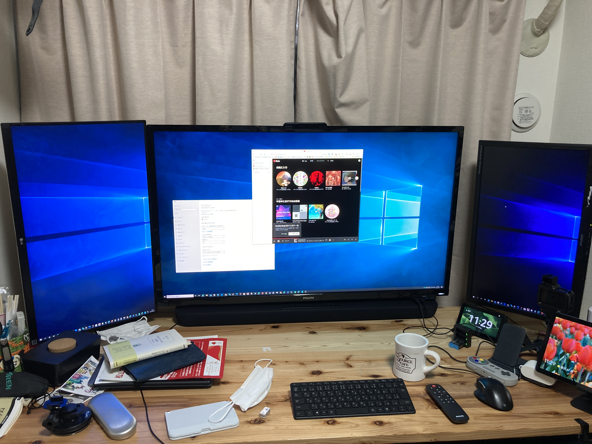

今日は僕とアドルフ・ヒトラーの誕生日です。お祝いのメッセージをくれた方、ありがとうございます！　国からもお祝いをいただいて、大変幸せです（震え声

<blockquote class="twitter-tweet">
うぎゃああああああああ！！  誕生日にこの仕打ちはないぜ！！ <a href="https://t.co/jUuLzuS02B">pic.twitter.com/jUuLzuS02B</a>
&mdash; だるやなぎですが、なにか？ (@daruyanagi) <a href="https://twitter.com/daruyanagi/status/1384296976414502915?ref_src=twsrc%5Etfw">April 20, 2021</a></blockquote> 

月日が経つのは早いもので、ボーっとしているうちに41歳になってしまいました。バカボンのパパと同い年ですが、いまだに独身で子どももいません。本当にヤバいですね……まぁ、ぶっちゃけ去年あたりから結婚はスッパリ諦めていて、一族における「何してるのかわからないおじさん」ポジションを目指して頑張っています。たまに東京の実家や弟妹の家に顔を出して、甥っ子や姪っ子に何か買ってあげる謎のおじさん。そういうのって一族に一人ぐらい必要だと思いませんか？　思いませんね。

自分への誕生日プレゼントは、ヤマハのサウンドバーにしました。Twitter でご意見を寄せてくれた皆様方、ありがとうございました。

<blockquote class="twitter-tweet">
投票作った
&mdash; だるやなぎですが、なにか？ (@daruyanagi) <a href="https://twitter.com/daruyanagi/status/1383932247955230729?ref_src=twsrc%5Etfw">April 18, 2021</a></blockquote> 

ちなみに、買ったのはこれ。こういうのはウーファー内蔵で 22,000 円ぐらいで各社ラインナップしているようですね。細かい違いは正直わかんなかったので、おとなしく Twitter の投票に従いました。ソニーとヤマハを候補にしていたのですが、デノンあたりもいいみたいですね。

[ヤマハ サウンドバー YAS-109 Alexa搭載 HDMI DTS Virtual:X Bluetooth対応 ブラック](https://www.amazon.co.jp/dp/B07TCDMKR2/?tag=bestylesnet-22#embed)

うちの PC サウンドはモニター内蔵のスピーカーで音がしょぼく、音楽は Echo Show で聞いていました。流石に悲しいのでサウンドバーというものを仕入れてみたのですが……本当は TV 向けなのかな？　結構大きかったです。とはいえ、ちゃんと寸法を測って購入したので、PC デスクの上、メインモニターの下にスッポリとハマりました。結構いい感じ。

<blockquote class="twitter-tweet">
すごい感動ってことはないけど、着実に改善された  置く場所を工夫すればもう少し良くなるかな  Alexa 搭載なので Echo Show が要らなくなった <a href="https://t.co/z55M5iE6hO">pic.twitter.com/z55M5iE6hO</a>
&mdash; だるやなぎですが、なにか？ (@daruyanagi) <a href="https://twitter.com/daruyanagi/status/1384337044470591491?ref_src=twsrc%5Etfw">April 20, 2021</a></blockquote> 

当初はオプティカルケーブルでつなぐ予定でしたが、あいにく新しいデスクトップ PC には搭載されていませんでした。古い方にはあったので、それと間違った／(^o^)＼ でも、HDMI で繋いだトリプルモニターのサブとの間にかますだけで簡単にセットアップできました。アップデートなどでサウンドバーに再起動がかかると、当該サブモニターに何も映らなくなるのは少し困りますが、まぁ、そんなに頻繁にあることじゃないので。

音質はビックリするほどではないかな……でも今までとは段違いなので満足。サウンドバーはコンパクトなので、普通のボックススタイル（？）のスピーカーが置けない環境でも OK。あと、この機種には Alexa が内蔵されていたので、Echo Show を退役させることもできました。書斎の Alexa は天気予報とタイマーにしか使っていないので、モニター付きの Echo Show じゃなくても十分役に立ちます。これはいい買い物だったかもしれない。設置場所や接続方式を見直せば、音質向上も狙えるかも。

で、もう一つ。おまけでステーショナリーも買いました。

[プラス ステーショナリーキット team-demi チームデミ ねず TD-001 30-213](https://www.amazon.co.jp/dp/B08GK4MTZM/?tag=bestylesnet-22#embed)

これも結構お気に入りかも。なかのツールや2ピースのボックスが磁石でくっつくようになっていて、収納が楽しい。

<blockquote class="twitter-tweet">
自分へのプレゼントその2！   箱が磁石でピタッと開閉するのいいな <a href="https://t.co/PqeUE88bXn">pic.twitter.com/PqeUE88bXn</a>
&mdash; だるやなぎですが、なにか？ (@daruyanagi) <a href="https://twitter.com/daruyanagi/status/1384344014271311875?ref_src=twsrc%5Etfw">April 20, 2021</a></blockquote> 

こういうのって、ツールを使ったあとに片づけるのが面倒で、そのうち1つ欠け、2つ欠け、挙句は使わなくなるというパターンになると思うのですが（少なくとも自分はそうなりがち）、こいつは片づけるのが気持ちいい。磁石でピタッ、ピタッと所定位置に収まります。消耗品の補充は少し心配ですが、長く使えそう。6,000 円とあまり安くないので、大事に使っていきたいですね。

そのほかにも、なんかいろいろプレゼントをいただきました。送ってくれた方、ありがとうございます！　とりあえず仏壇にお供えしてから、ちょこっとずつ使わせていただこうと思います。

それでは、今年も一年頑張りましょう！